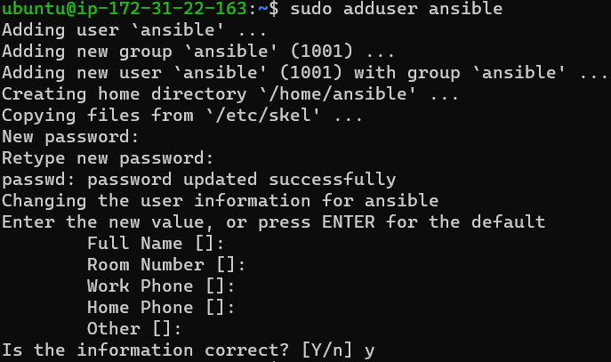

Ansible Set Up
--------------

* Take 2 or more Linux Machines One is Control Node and Other one is Node.
* Create a user with same name in every linux machine. Ex: ansible

* give the user to sudo privilages on every machine by editing `sudoers` file.
* In AWS Virtual Machines PasswordAuthentication disabled Defaltly.
* To Enable that we can edit `/etc/ssh/sshd_config`.
*  