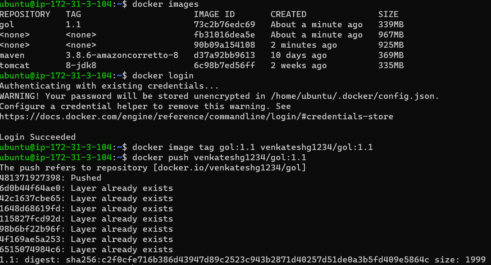
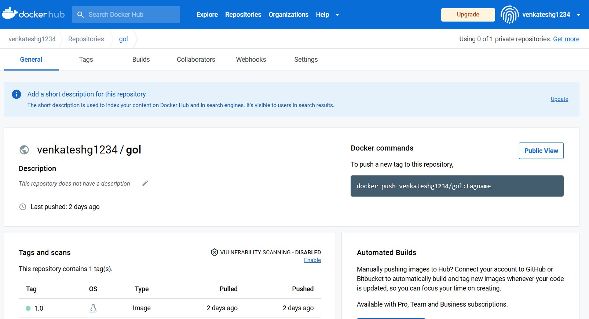
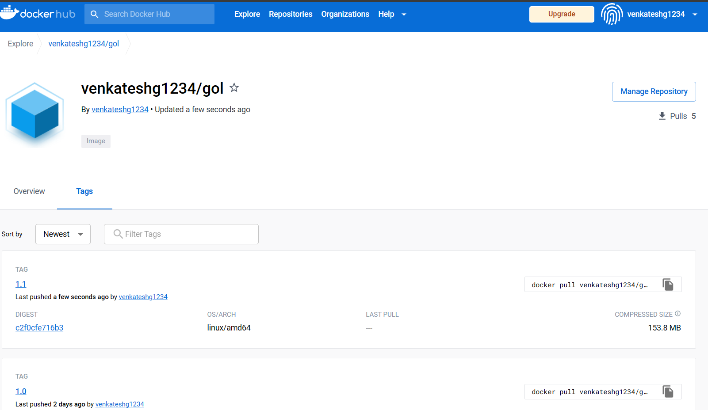
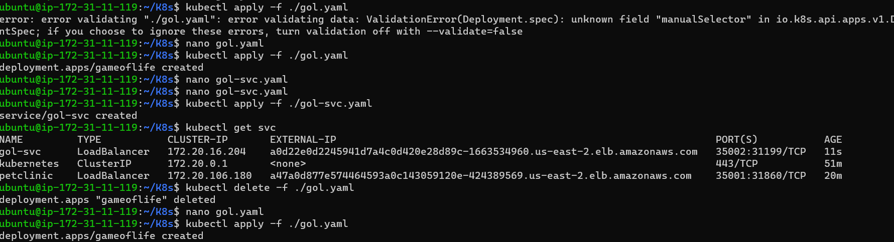
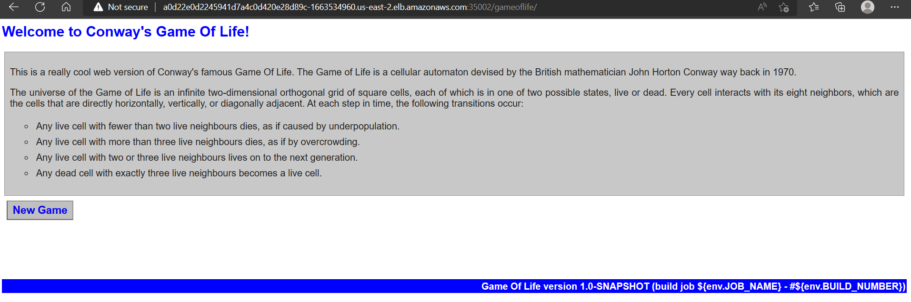

# GAMEOFLIFE K8S DEPLOYMENT
  * to Deploy a Application into K8s we need container images, for that we use Docker as a container technology.
  * to build a docker image we need Source Code, we got the source from git hub [ReferHere](https://github.com/GUDAPATIVENKATESH/game-of-life.git)
  
**Building Docker Image**

  * Build a war file from gameoflife source code.
  * Build an Docker image from war file
    ```Dockerfile
      FROM maven:3.8.6-amazoncorretto-8 as build
      RUN yum upgrade && yum install git -y 
      RUN git clone https://github.com/GUDAPATIVENKATESH/game-of-life.git
      RUN cd /game-of-life
      RUN mvn clean package

      FROM tomcat:8-jdk8
      EXPOSE 8080
      COPY --from=build /game-of-life/gameoflife-web/target/gameoflife.war /usr/local/tomcat/webapps/gameoflife.war
      CMD ["catalina.sh", "run"]

    ```
  
# Pushing the Image to Docker Hub
  * Then push the image into docker hub registory
    
    
  * Now create a K8s deployment workload and service
    ```yaml
     ---
      #Deployment
      apiVersion: apps/v1
      kind: Deployment
      metadata:
        name: gameoflife
      spec:
        minReadySeconds: 9
        replicas: 2
        selector:
          matchLabels:
            app: gameoflife
          strategy:
            rollingUpdate:
              maxSurge: 50%
              maxUnavailable: 50%
            type: RollingUpdate
          template:
            metadata:
              name: gol-temp
              labels:
                app: gameoflife
              namespace: joip-task
            spec:
              containers:
                - name: gameoflife
                  image: venkateshg1234/gol:1.0
                  ports:
                    - containerPort: 8080
                      protocol: TCP
                      command: ["catalina.sh", "run"]
          


  ---
    #Service
    apiVersion: v1
    kind: Service
    metadata:
      name: gol-svc
    spec:
      type: LoadBalancer
      selector:
        app: gameoflife
        ports:
          - port: 35002
            targetPort: 8080
            protocol: TCP
  ```


