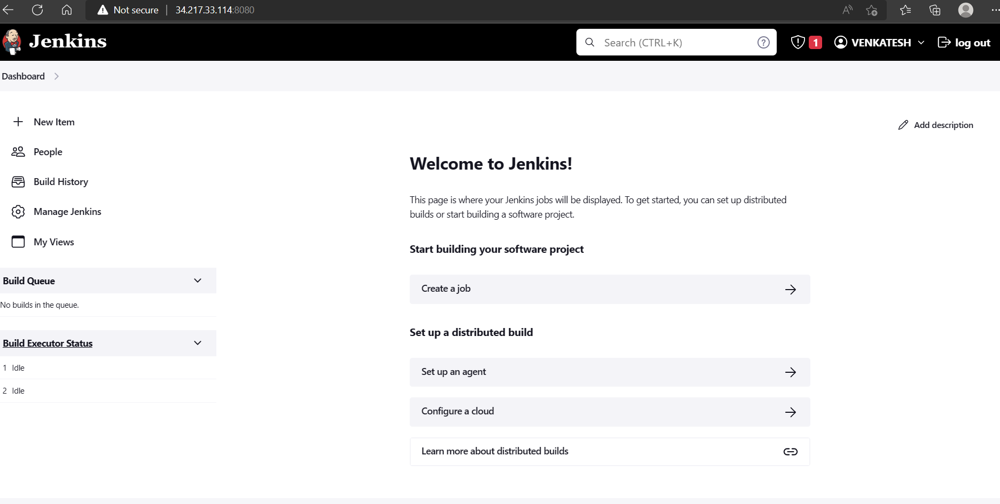
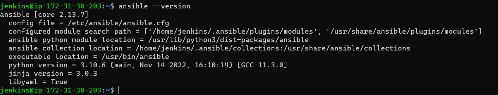
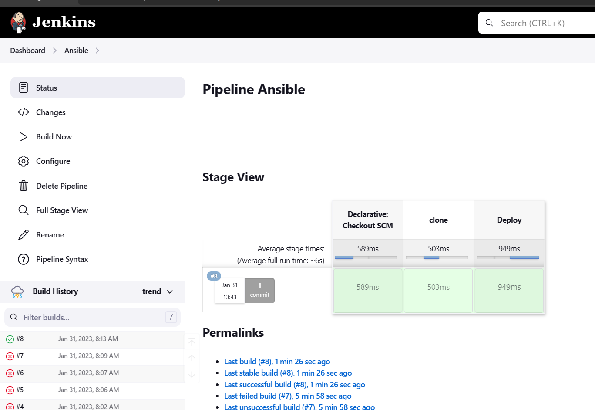

Integrating Ansible with Jenkins
--------------------------------

* Prepare Jenkins & Ansible Servers
* For Jenkins Installation on ubuntu `ensure Java-11 is presented on the system` [ReferHere](https://www.jenkins.io/doc/book/installing/linux/#debianubuntu)
* For Ansible Installation on Ubuntu `ensure python-3 is presented on the system` [ReferHere](https://docs.ansible.com/ansible/latest/installation_guide/installation_distros.html#installing-ansible-on-ubuntu)
* Jenkins Server is up & running

* Ansible Control node was Up & running



Installing Apache2 in with ansible playbook
--------------------------------------------

* To write playbook for any configuration we need to know the manual steps for installation.
```
sudo apt update
sudo apt install apache2 -y
```
* for the above steps we are writing [palybook](https://github.com/GUDAPATIVENKATESH/Ansible/blob/main/apache2.yml)
* also write [Jenkinsfile](https://github.com/GUDAPATIVENKATESH/Ansible/blob/main/Jenkinsfile)

* Build Pipeline
