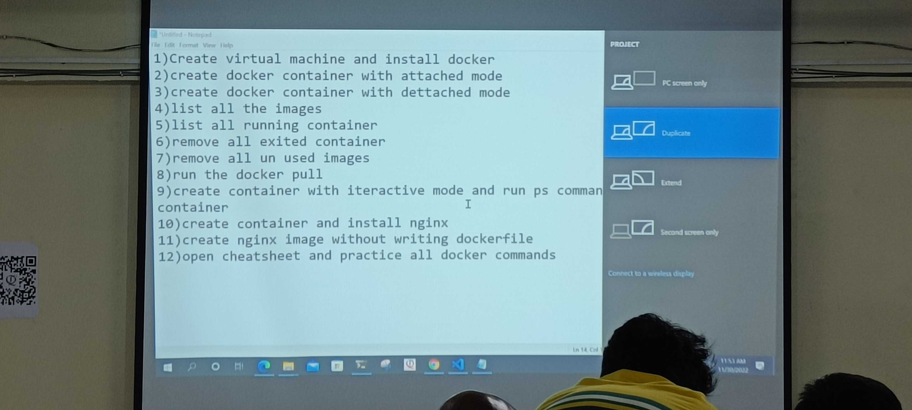

# JOIP Tasks
CICD
----
> 2022-10-07
1. Create a jenkins master with 2 Nodes
   * First Node :
        - Any Linux
        - UserName & Key --> Tools To Be Installed MVN3, NVM, Python3, Pip3
      * Labels :
        - MVN3 JDK11 NVM PY3
   * Second Node :
        - Any Linux
        - UserName & PassWord --> Tools to be Installed Gradle, Python3, NVM
      * Labels :
        - GRADLE JDK11 NVM PY3
2. Declarative Pipeline for 
                         - OpenMRS --> SPRINT_1_DEV(Any Commit)
                                   --> SPRINT_1_REL(Night Build)
                         - Shopizer       
3. Artifactory Cloud Account

> 2022-10-09
* Build .NET Project in Jenkins Freestyle, Scripted & Declarative.

> 2022-10-16
* Shopizer --> Fork --> Main/Master(Branch) --> Devlop(Branch) --> Build for every 
                                                                   commit
                                          --> Release(Branch) --> Build at 11:00PM(IST)
* Promote DayBuild --> 10:30PM(IST) Merge Using --no-ff From Devlop to Release.
* Promote Release --> Release --> Main

> 2022-10-27
1. Create a Shopizer Dependencie & run it.
2. Create a GameofLife Dependencie & run it.
3. Run all maven Goals & Check it.

> 2022-11-01
* Write a Declarative Pipeline for SpringPetClinic/GameofLife/Shopizer/OpenMRS & Send the Artifacts To JFrog 
  1. Create JFrog Account
  2. Configure JFrog in Jenkins
  3. Write Diclarative Pipeline for sending Artifactory into JFrog.
  4. Install Sonarqube & Configure to Jenkins.
  5. Write Declarative Pipeline for SpringPetClinic/GameofLife/Shopizer/OpenMRS Using Sonarqube.
## Terraform
> 2022-10-28
1. Create an aws ec2 with cli configured & Create an AMI of that with Packer.
2. Node --> Workspace --> /home/ubuntu/ntier --> Manually Terraform init
3. Create resources in multiple regions with Terraform template at a single shot. Find 
out the Option? 

> 2022-11-01
* AWS :
  * Write a Terraform code to Create AutoScalling Group with Minimum 1 ec2 and Maximum 3 ec2.
  * Configure Health Checks with TCP.
  * Use Packer to Create an AMI 
  * Do this with Jenkins

> 2022-11-05
* AWS :
  * One VPC
  * Two Subnets
  * One EC2
  * Backend (create S3 Bucket & DynamoDB Manually & Configure Backend)
* Do this from Cloud Formation

> 2022-11-11
* Create a Terraform Template for Following Scenario
* Architecture 

* Things to be taken Care of :
  * Use Workspace & Backends
  * Optionally you can also use existing modules from registry
  * Use null resource for provisioning
  * Steps for installing the application
  ```
    git clone https://github.com/gothinkster/angular-realworld-example-app.git 
    cd angular-realworld-example-app 
    npm install -g @angular/cli 
    npm install
    # To start the application http://localhost:4200 
    # ng serve ("ng serve --host 0.0.0.0")
  ```
  * Try making ng serve a linux daemon.

> 2022-11-30
### Docker

* Task-01
  1. Create VM & Install Docker
  2. Create Docker Container With Attached Mode
  3. Create Docker Container With Dettached Mode
  4. List all the Images
  5. List all Running Containers
  6. Remove all Exited Containers
  7. Remove all Un-Used Images
  8. Run the Docker Pull
  9. Create Container with Interactivemode and Run PS Command Inside the Container
  10. Create Container and Install Nginx
  11. Create Nginx Image Without Writting Dockerfile
  12. Open Cheatsheet and Practice all Docker Commands


> 2022-12-04
JOIP TEAM (TULSA)
* G VENKATESH
* BHAVANI J
* N SURESH
* KRISHNA REDDY
* UDAY KIRAN
* N KANNAN
* B SARITHA
* SK MOIN 
* KASIM  
* NAGESWARARAO

> 2022-12-06
* Docker
Inspect Image History
---------------------
* Hint: Use Docker History Command
* Pull any Image of your Choise

Docker Container
----------------
* Create a Hello-World Container 
* Create A Nginx Container
* Demonstrate why the Hello-World Container is in Stopped State and Nginx Container is still Running
* Demonstrate Docker Container Life Cycle :
  * create whet
  

## Instruct ELSA to find factors of 30
1. Hello ELSA
2. Help me to find out the factors of 30
3. start with number 1 and find out 30 is divisible by 1.
4. if the remainder is 0 add that number to list.
5. if the remainder is not 0 don't add the number to the list. 
6. repeat step 4 and 5 with numbers 1 to 29.  
## Instruct ELSA to find 39 is prime or not
1. start = 2
2. number = 39
3. remainder = number % start
4. if remainder != 0
5. repeat this until start =< number/2 
6. print(prime) 
## instruct elsa to print fibonnaci serires till 100

number = 0
start = 1
sum = 0
until [[ number -eq 100 ]] 
number += ppp  1

> 2022-12-07
* Docker
  *  Create ant container mysql or nginx or jenkins
    * check the container is in running state or not
    * pause the container 
    * unpause the container  
    * stop the container 
    * start the container 
    * terminate the container
  * create an alpine container with name serv01 & ubuntu:22.04 with serv02
    * ensure sleep 1d is passed as argument
    * try running exec command without it to print the contents of the root container
    * try executing command in interactive mode and install apache server
  * create the jenkins/jenkins in detached mode & now attach to view the logs
  * find the location of logs for the container on the docker hosts
* Dockerfile
  * create the docker image using dockerfile with alpine as base and git installed in it
    * make a not of layers of alpine & the layers of the image created by you
  * try to write dockerfile instruction       

##  Palendrome
* take a number 
* devide it with 10 and note down the remainder as reverse and Quotient as number
* then repeat this and multiply previous reverse with 10 and add present reverse to it
* repeat this process until Quotient as 0
number = input("enter a number")

> 2022-12-17
**K8s**
* Create Nginx,Tomcat,Httpd & SoringPetClinic Containers.