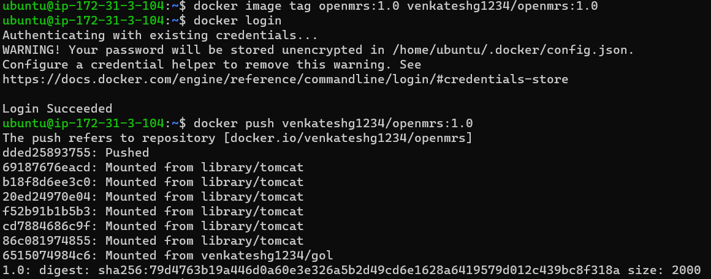
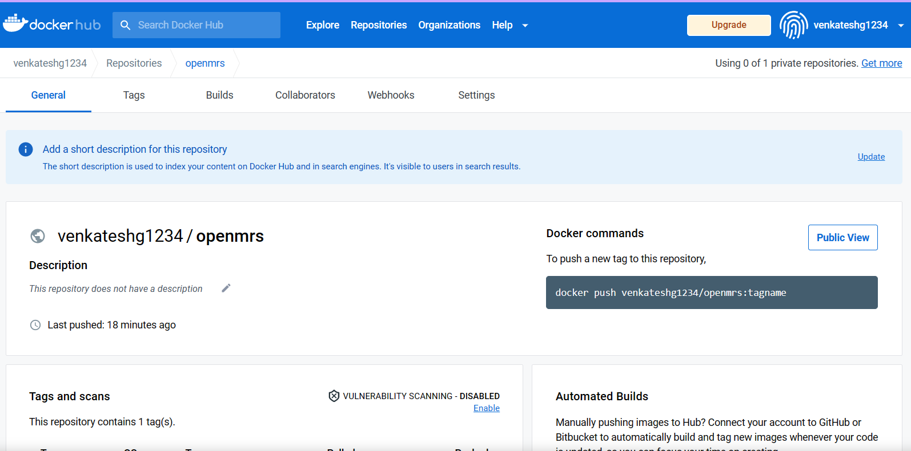
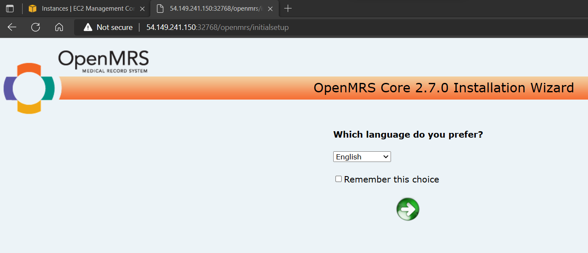

# OpenMRS K8s Deployment

**Docker Image Building with Multi-Stage**
  * OpenMRS source code [Copy From Here](https://github.com/openmrs/openmrs-core.git)
  * Write down the Dockerfile for building Docker Image
    ```Dockerfile
    FROM maven:3-jdk-8 as build
    RUN git clone https://github.com/openmrs/openmrs-core.git && cd openmrs-core && mvn clean package

    FROM tomcat:8
    COPY --from=build /webapp/target/openmrs.war /usr/local/tomcat/webapps/openmrs.war
    EXPOSE 8080
    CMD ["catalina.sh", "run"]
    ```
  * After Building the Docker Image from Dockerfile, push the docker image to docker hub
  
  
  * then run the container 
  

## OpenMRS Deployment with Kubernetes Manifest

```yaml
---
#Deployment
apiVersion: apps/v1
kind: Deployment
metadata:
  name: openmrs
spec:
  minReadySeconds: 9
  replicas: 2
  selector:
    matchLabels:
      app: openmrs-po
  strategy:
    rollingUpdate:
      maxSurge: 50%
      maxUnavailable: 50%
    type: RollingUpdate
  template:
    metadata:
      name: opemrs-temp
      labels:
        app: openmrs-po
    spec:
      containers:
        - name: openmrs-sped
          image: venkateshg1234/openmrs:1.0
          ports:
            - containerPort: 8080
              protocol: TCP
          command: ["catalina.sh", "run"]
          


---
#Service
apiVersion: v1
kind: Service
metadata:
  name: openmrs-svc
spec:
  type: LoadBalancer
  selector:
      app: openmrs-po
  ports:
    - port: 35002
      targetPort: 8080
      protocol: TCP
```

