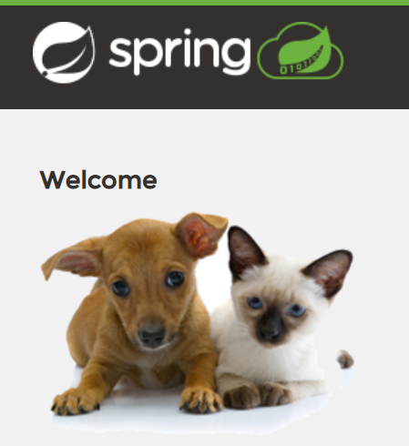
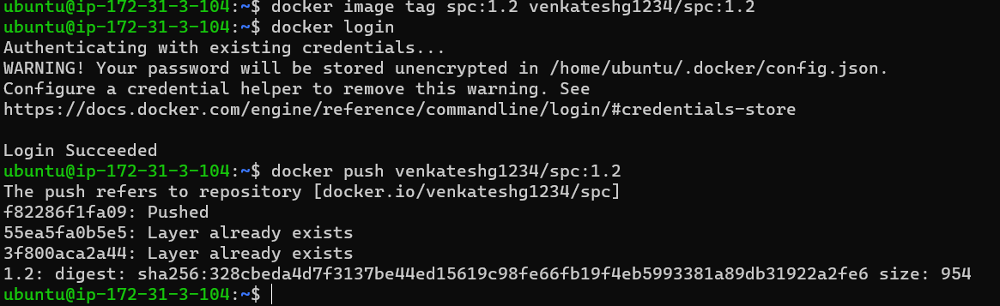
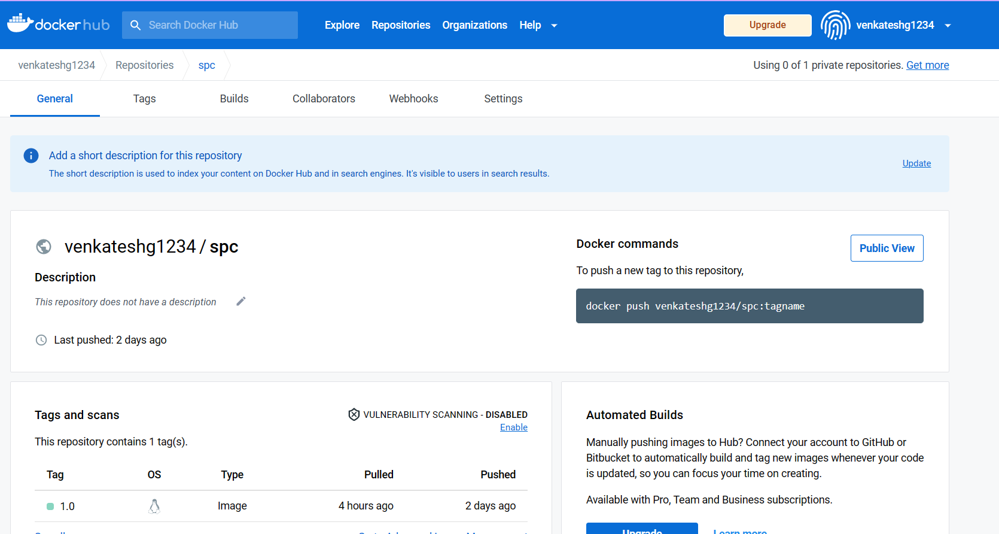
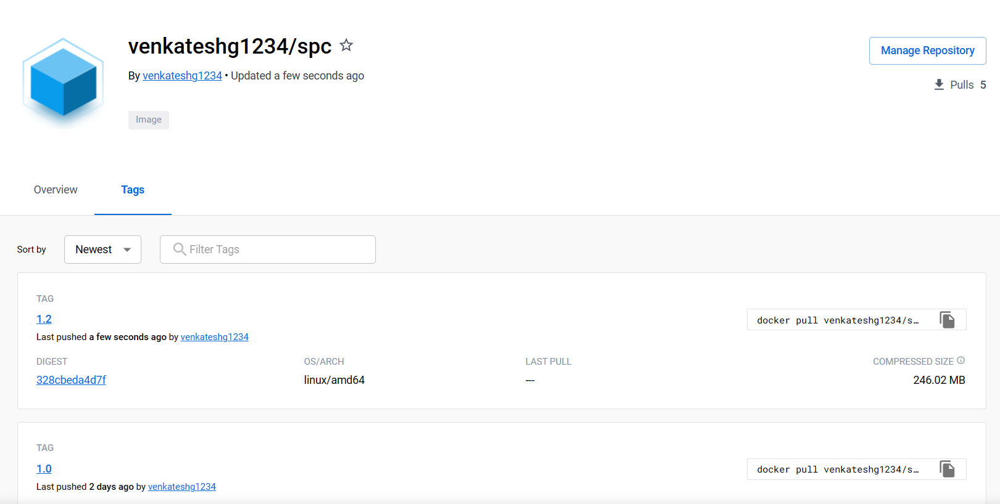
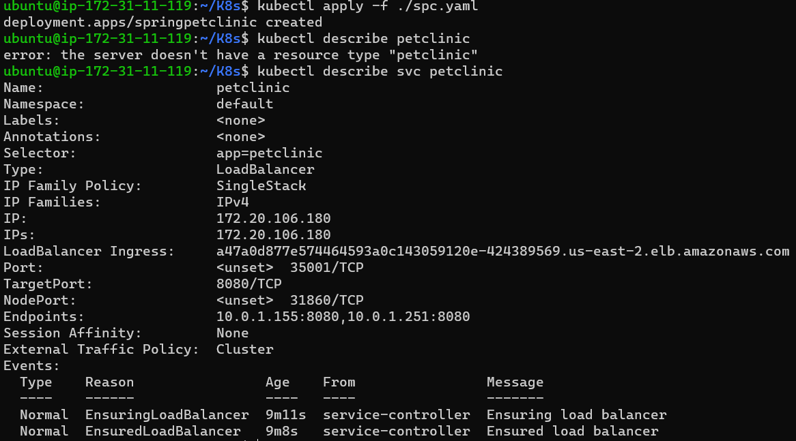
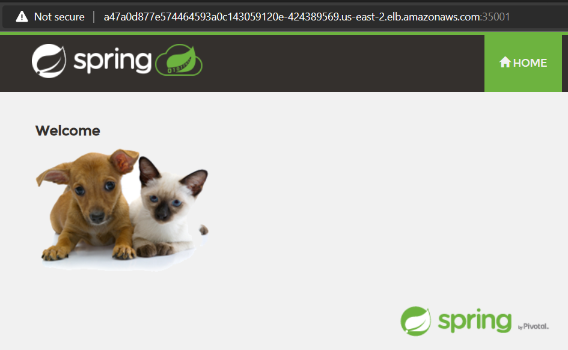

# SPRINGPETCLINIC K8s Deployment
  
  * To deploy a Appliction into k8s we need a container image . 
  * To build that image we need source code [ClickHere](https://github.com/GUDAPATIVENKATESH/spring-petclinic.git) 
  * SpringPetClinic is a java based project, it need java-11 & maven build tool for package building
  * for VM Deployment the manul commands were
    ```#!/bin/bash
     apt install openjdk-11-jdk maven git -y
     git clone https://github.com/GUDAPATIVENKATESH/spring-petclinic.git
     mvn package
     cd spring-petclinic/target/
     java -jar ./spring-petclinic-2.7.3.jar
     ```
# SpringPetClinic Docker Image Building with MultiStage Image Building Method
  ```Dockerfile
   FROM maven:3.8.6-amazoncorretto-11 as build
   RUN yum upgrade
   RUN yum install git -y
   RUN git clone https://github.com/GUDAPATIVENKATESH/spring-petclinic.git
   WORKDIR /spring-petclinic
   RUN mvn clean package

   FROM amazoncorretto:11
   COPY --from=build /spring-petclinic/target/spring-petclinic-2.7.3.jar /spring-petclinic-2.7.3.jar
   EXPOSE 8080
   CMD ["java", "-jar", "/spring-petclinic-2.7.3.jar"]
  ```
  * after building the image 
  
  * Push the docker image into docker registory
  
  
# Dploying SpingPetClinic with K8s
  * for that i used AWS EKS Cluster, to know more [ReferHere](https://github.com/GUDAPATIVENKATESH/Documentation/blob/main/EKS-ClusterSetUp.md)
  * K8s Manifest for SPC Deployment
  ```yaml
   ---
  #Deployment
  apiVersion: apps/v1
  kind: Deployment
  metadata:
    name: springpetclinic
    labels:
      app: springpetclinic
  spec:
    minReadySeconds: 9
    replicas: 2
    selector:
      matchLabels:
        app: petclinic
    strategy:
      type: RollingUpdate
    template:
      metadata:
        name: petclinic-temp
        labels:
          app: petclinic
      spec:
        containers:
          - name: petclinic
            image: venkateshg1234/spc:1.0
            ports:
              - containerPort: 8080
                protocol: TCP
            command: ["java","-jar","/spring-petclinic-2.4.2.jar"]
      ---
  #Service
  apiVersion: v1
  kind: Service
  metadata:
    name: petclinic
  spec:
    type: LoadBalancer
    selector:
      app: petclinic
    ports:
      - port: 35001
        targetPort: 8080
        protocol: TCP
  ```
  * Deployed the application in K8s, to acess that application from out side world we created a service with load balancer.

