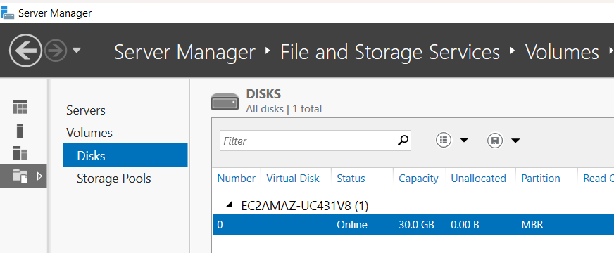
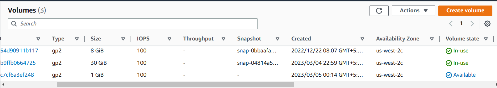
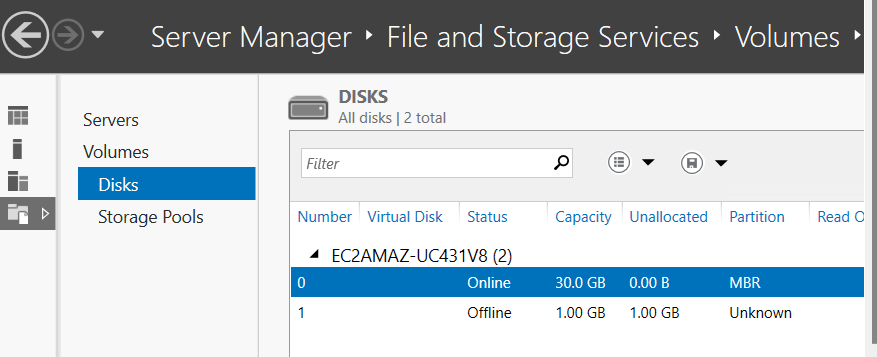
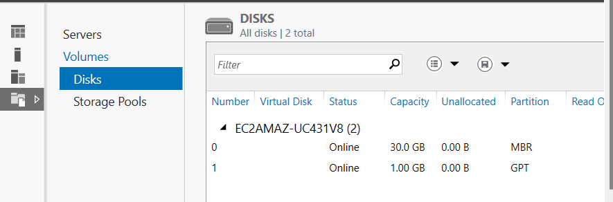
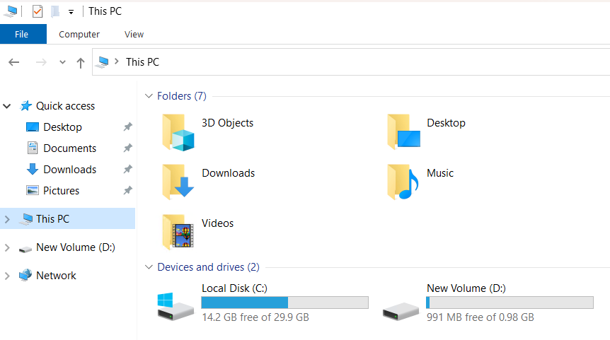
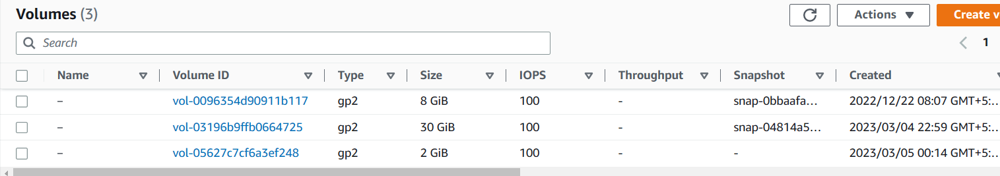
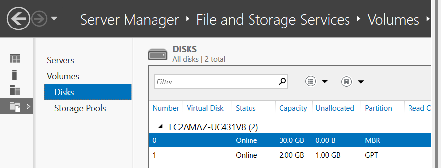
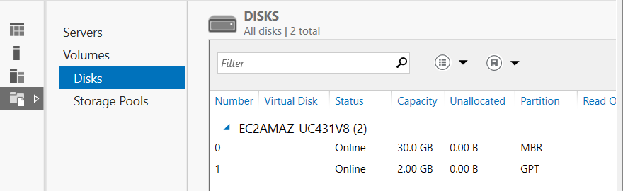

Elastic Block Storage
---------------------

* Created a Windows server with 30 GB Volume in AWS.

* Created EBS volume of size 1GB of `General Purpose SSD` on the same Availability zone that EC2 Instance was present.

* Attach the EBS volume to Windows Server.
* Then in Windows server, Navigate to `Server Manager` > `File and Storage Services` > ` Volumes` > `Disk`.

* You can find that newly added EBS volume Offline & Unallocated.
* We can bring it Online & add it as New Volume Without stopping the EC2 Instance.

* Now i want to modify the size of newly attached volume.

* Modified volume attached to windows server, but the additional volume was unallocated.

* We have to add that as a new volume.

* In windows NTFS(New Technology File System) file system was using.
* I have increased the volume size & attached it to server.
* Now i want to decrease the volume size, but in AWS EBS we can only increase the volume size by modifying the size we can't decrease the volume.

 
* If you want to decrease the volume create backup of the volume by creating the EBS snapshot & create another volume of desired size by using the snapshot.

