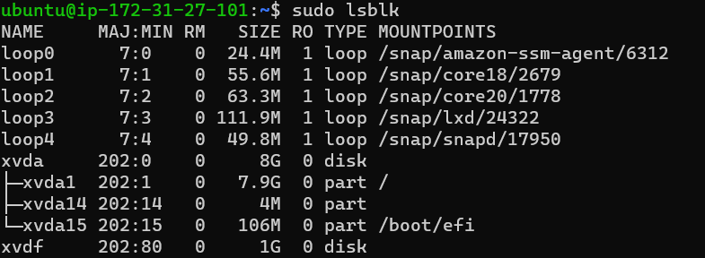
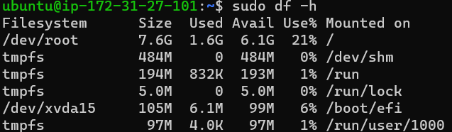
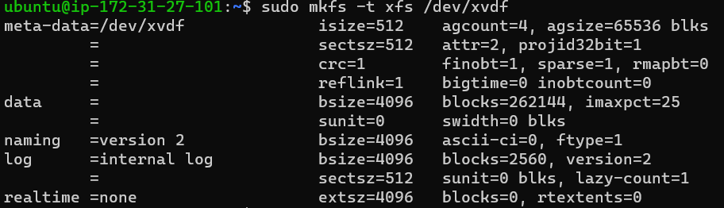
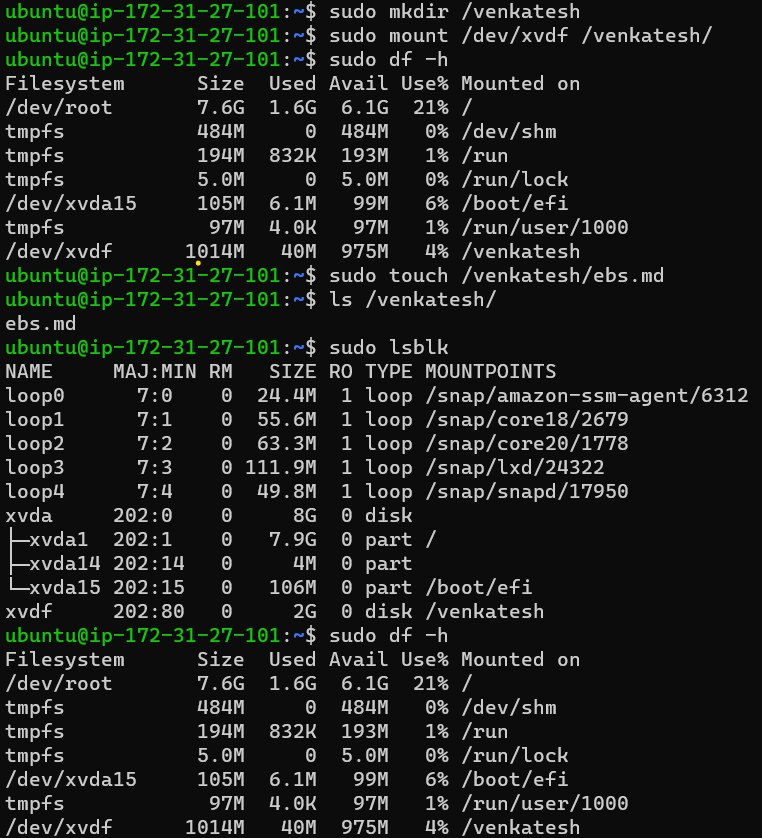
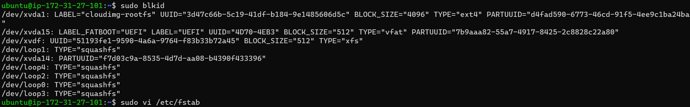

Elastic Block Storage for Linux
-------------------------------

* A Document from Azure to explain the [Volume Mount](https://learn.microsoft.com/en-us/azure/virtual-machines/linux/add-disk?tabs=ubuntu) 
* Create a linux machine & create EBS volume of size 1 GB.
* Attach the EBS volume to EC2 Instance.
* Login into ec2 incstance and the attached volumes of linux machine by executing `sudo lsblk`.
* `lsblk` means `list information about all available block devices on a system`.

* Then execute `sudo df -h`, it will `show the amount of disk space used and available on file systems`.

* Above image shows that new volume was not mounted.
* To do that we have to create a file system in Volume, In linux we have multiple type of file systems Ex: xfs,ext
* To create file system `sudo mkfs -t xfs <name of the EBS>`.
* In AWS the naming of EBS for linux was /dev/xvda, /dev/xvdb, /dev/xvdc, ....

* Then create folder on existing file system and mount the new volume to it.
* In windows we have a concept of drivers, but in linux we did't had that, that's why we are creating folder & mounting the volume to that folder.

* with this method we can mount volumes, but if you stop the machine & restart the machine this mounts will not present.
* to solve that we add these mount information to `/etc/fstab`.

* `UUID=<UUID of dick> <directory to mounted> <type of file ststem>`
* to UUID, Type of file system & any other details use `sudo blkid` .
* `UUID=51193fe1-9590-4a6a-9764-f83b33b72a45   /venkatesh   xfs   defaults,nofail   1   2`.