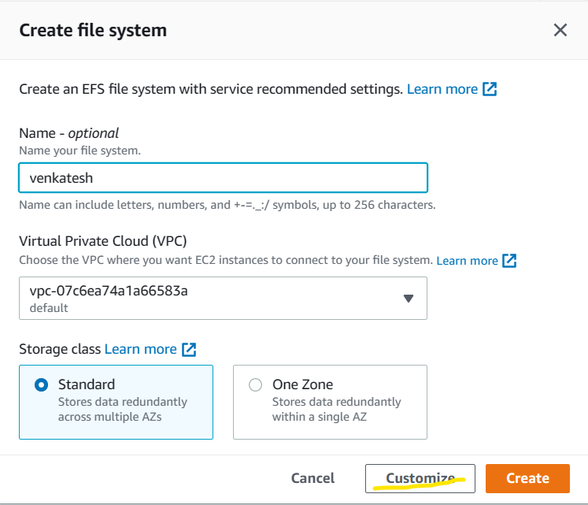
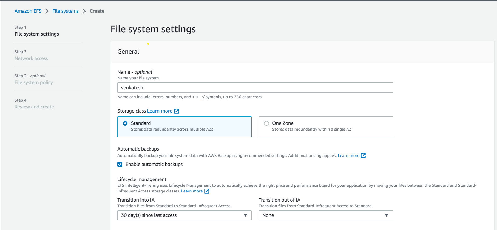
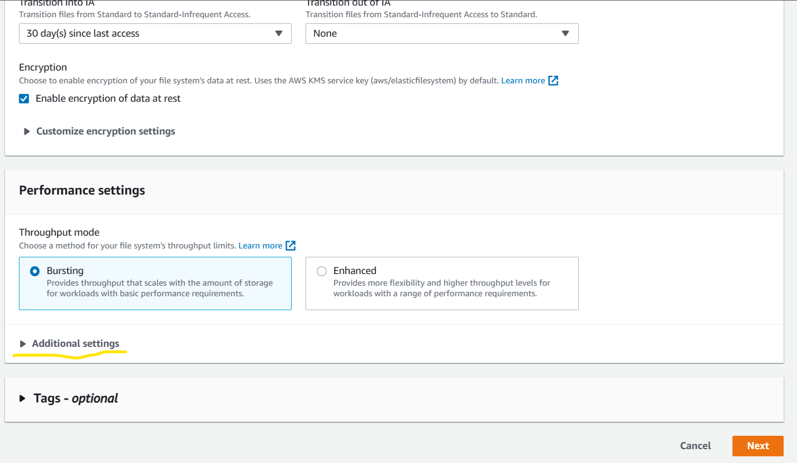
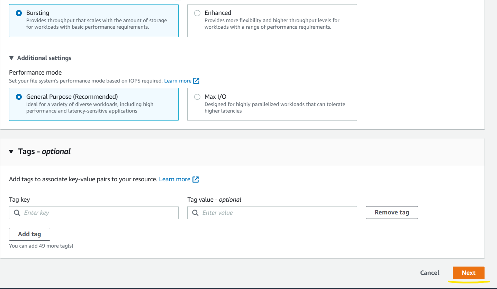
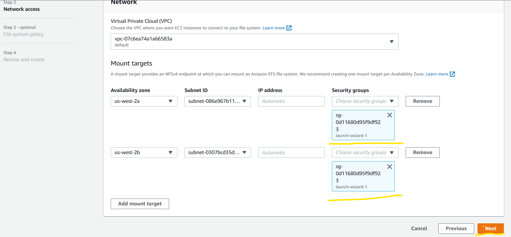
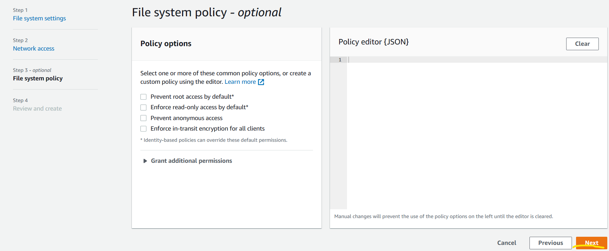
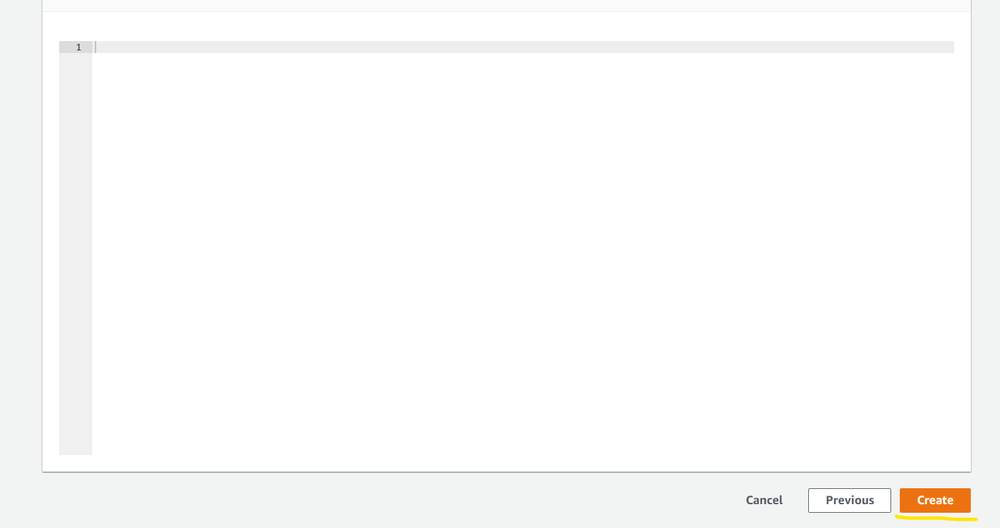

EFS (Elastic File System)
-------------------------

* AWS EFS (Amazon Elastic File System) is a fully managed, scalable, and elastic file storage service provided by Amazon Web Services (AWS). 
* It is designed to provide a shared file storage system that can be accessed by multiple Amazon Elastic Compute Cloud (EC2) instances, making it an ideal solution for applications that require shared access to a common data source.

* EFS supports the Network File System version 4 (NFSv4) protocol, which allows you to mount EFS file systems to EC2 instances using standard NFS clients. 
* This means that applications running on EC2 instances can read and write data to the EFS file system just like they would to a local file system, but with the added benefit of being able to share data across multiple instances.

* EFS is a highly available and durable service, with data stored across multiple availability zones (AZs) within a region to provide high availability and durability.
* EFS also supports file system encryption at rest and in transit, providing additional security for sensitive data.

* With AWS EFS, you pay only for the storage and throughput that you use, and there are no minimum fees or setup costs. This makes it a cost-effective solution for many use cases.

* Create 2 Linux machines in AWS
* Create a EFS File System in AWS 







* Now to mount EFS File System, the respected linux systems need to have [EFS Client](https://docs.aws.amazon.com/efs/latest/ug/installing-amazon-efs-utils.html).
* For Ubuntu
```
sudo apt-get update
sudo apt-get -y install git binutils
git clone https://github.com/aws/efs-utils
cd /efs-utils
./build-deb.sh
sudo apt-get -y install ./build/amazon-efs-utils*deb
```

* With the above commands you can install utills
* Then create new folder and Mount the EFS File System to that folder 
```
sudo mount -t efs -o tls fs-0f978619749896686:/ <folder-name>
```

* Then any content added to folder in one linux, the same content reflect in all the other linux machines connected to the EFS File System.
* If you want to make the EFS mount permanent you need to add the mount entries to `/etc/fstab`.
* Here we we have done mount via DNS.
* So the entry format would be `fs-0f978619749896686:/ <folder-name> efs _netdev,TLS 0 0`
* After this reboot your system or enter the `sudo mount - a`. This command will apply the latest changes.