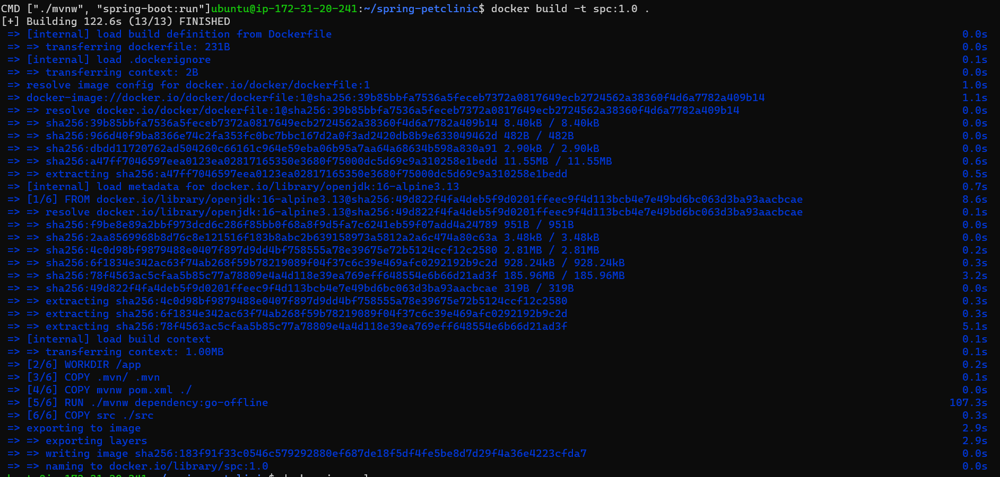
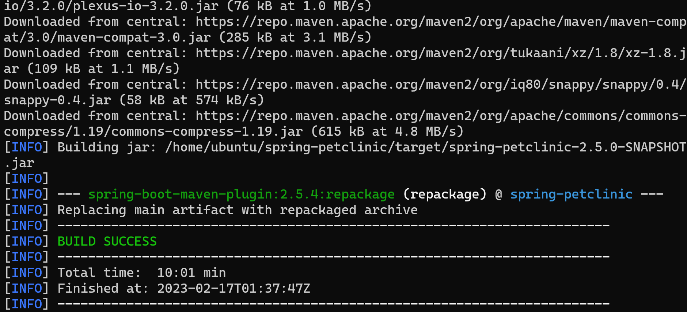
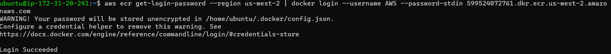
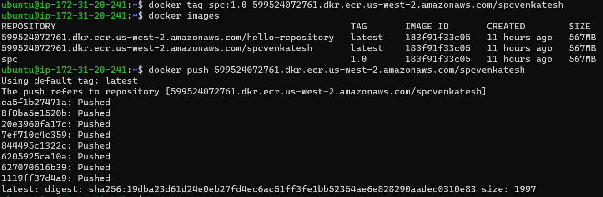
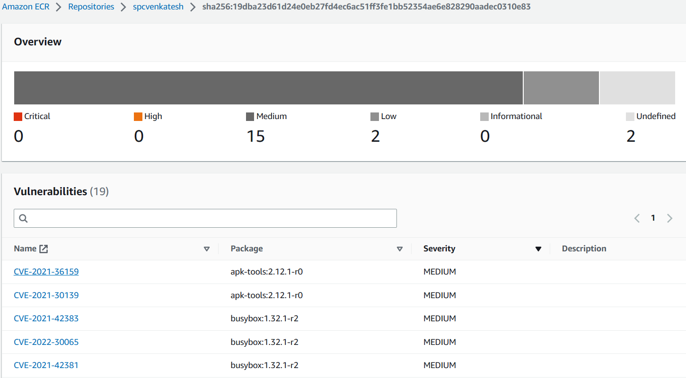
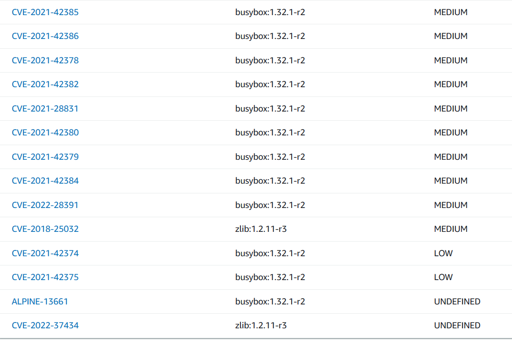

SpringPetClinic Docker Image Scaning (CVE) Common Vulnerabilities & Exposures
-----------------------------------------------------------------------------
* Took a Ubuntu-22.04 VM and installed grype init
```
wget -qO - https://raw.githubusercontent.com/anchore/grype/main/install.sh | sudo bash -s -- -b /usr/local/bin
```

* For installing [docker](https://get.docker.com/)
```
curl -fsSL https://test.docker.com -o test-docker.sh
sh test-docker.sh
sudo usermod -aG docker ubuntu
``` 

* Clone [SpringPetClinic](https://github.com/darinpope/spring-petclinic.git) Code to home directory
```
git clone https://github.com/darinpope/spring-petclinic.git
```
* Checkout form `main` to `grype` branch 
* Then build the docker image

* Then scan the docker image for Vulnerabilities
```
grype spc:1.0 --scope AllLayers
```
* Vulnerabilities
```
 ✔ Vulnerability DB        [no update available]
 ✔ Loaded image
 ✔ Parsed image
 ✔ Cataloged packages      [737 packages]
 ✔ Scanned image           [503 vulnerabilities]
NAME                            INSTALLED      FIXED-IN   TYPE          VULNERABILITY        SEVERITY
ant                             1.8.2                     java-archive  CVE-2020-1945        Medium
ant-launcher                    1.8.2                     java-archive  CVE-2020-1945        Medium
apk-tools                       2.12.1-r0      2.12.5-r0  apk           CVE-2021-30139       High
apk-tools                       2.12.1-r0      2.12.6-r0  apk           CVE-2021-36159       Critical
busybox                         1.32.1-r2      1.32.1-r4  apk           CVE-2021-28831       High
busybox                         1.32.1-r2      1.32.1-r7  apk           CVE-2021-42374       Medium
busybox                         1.32.1-r2      1.32.1-r7  apk           CVE-2021-42375       Medium
busybox                         1.32.1-r2      1.32.1-r7  apk           CVE-2021-42378       High
busybox                         1.32.1-r2      1.32.1-r7  apk           CVE-2021-42379       High
busybox                         1.32.1-r2      1.32.1-r7  apk           CVE-2021-42380       High
busybox                         1.32.1-r2      1.32.1-r7  apk           CVE-2021-42381       High
busybox                         1.32.1-r2      1.32.1-r7  apk           CVE-2021-42382       High
busybox                         1.32.1-r2      1.32.1-r7  apk           CVE-2021-42383       High
busybox                         1.32.1-r2      1.32.1-r7  apk           CVE-2021-42384       High
busybox                         1.32.1-r2      1.32.1-r7  apk           CVE-2021-42385       High
busybox                         1.32.1-r2      1.32.1-r7  apk           CVE-2021-42386       High
busybox                         1.32.1-r2      1.32.1-r8  apk           CVE-2022-28391       High
busybox                         1.32.1-r2      1.32.1-r9  apk           CVE-2022-30065       High
commons-beanutils               1.7.0                     java-archive  CVE-2014-0114        High
commons-beanutils               1.7.0                     java-archive  CVE-2019-10086       High
commons-beanutils               1.8.3                     java-archive  CVE-2014-0114        High
commons-beanutils               1.8.3                     java-archive  CVE-2019-10086       High
commons-beanutils               1.8.3          1.9.2      java-archive  GHSA-p66x-2cv9-qq3v  High
commons-beanutils               1.8.3          1.9.4      java-archive  GHSA-6phf-73q6-gh87  High
commons-collections             3.2.1                     java-archive  CVE-2015-6420        High
commons-collections             3.2.1          3.2.2      java-archive  GHSA-6hgm-866r-3cjv  High
commons-collections             3.2.1          3.2.2      java-archive  GHSA-fjq5-5j5f-mvxh  Critical
commons-compress                1.19                      java-archive  CVE-2021-35515       High
commons-compress                1.19                      java-archive  CVE-2021-35516       High
commons-compress                1.19                      java-archive  CVE-2021-35517       High
commons-compress                1.19                      java-archive  CVE-2021-36090       High
commons-compress                1.19           1.21       java-archive  GHSA-7hfm-57qf-j43q  High
commons-compress                1.19           1.21       java-archive  GHSA-crv7-7245-f45f  High
commons-compress                1.19           1.21       java-archive  GHSA-mc84-pj99-q6hh  High
commons-compress                1.19           1.21       java-archive  GHSA-xqfj-vm6h-2x34  High
commons-compress                1.20                      java-archive  CVE-2021-35515       High
commons-compress                1.20                      java-archive  CVE-2021-35516       High
commons-compress                1.20                      java-archive  CVE-2021-35517       High
commons-compress                1.20                      java-archive  CVE-2021-36090       High
commons-compress                1.20           1.21       java-archive  GHSA-7hfm-57qf-j43q  High
commons-compress                1.20           1.21       java-archive  GHSA-crv7-7245-f45f  High
commons-compress                1.20           1.21       java-archive  GHSA-mc84-pj99-q6hh  High
commons-compress                1.20           1.21       java-archive  GHSA-xqfj-vm6h-2x34  High
commons-compress                1.9                       java-archive  CVE-2018-11771       Medium
commons-compress                1.9                       java-archive  CVE-2021-35515       High
commons-compress                1.9                       java-archive  CVE-2021-35516       High
commons-compress                1.9                       java-archive  CVE-2021-35517       High
commons-compress                1.9                       java-archive  CVE-2021-36090       High
commons-compress                1.9            1.18       java-archive  GHSA-hrmr-f5m6-m9pq  Medium
commons-compress                1.9            1.21       java-archive  GHSA-7hfm-57qf-j43q  High
commons-compress                1.9            1.21       java-archive  GHSA-crv7-7245-f45f  High
commons-compress                1.9            1.21       java-archive  GHSA-mc84-pj99-q6hh  High
commons-compress                1.9            1.21       java-archive  GHSA-xqfj-vm6h-2x34  High
commons-httpclient              3.1                       java-archive  CVE-2012-5783        Medium
commons-httpclient              3.1                       java-archive  CVE-2020-13956       Medium
commons-io                      1.4            2.7        java-archive  GHSA-gwrp-pvrq-jmwv  Medium
commons-io                      2.2                       java-archive  CVE-2021-29425       Medium
commons-io                      2.2            2.7        java-archive  GHSA-gwrp-pvrq-jmwv  Medium
commons-io                      2.4                       java-archive  CVE-2021-29425       Medium
commons-io                      2.4            2.7        java-archive  GHSA-gwrp-pvrq-jmwv  Medium
commons-io                      2.5                       java-archive  CVE-2021-29425       Medium
commons-io                      2.5            2.7        java-archive  GHSA-gwrp-pvrq-jmwv  Medium
commons-io                      2.6                       java-archive  CVE-2021-29425       Medium
commons-io                      2.6            2.7        java-archive  GHSA-gwrp-pvrq-jmwv  Medium
dom4j                           1.1            2.0.3      java-archive  GHSA-6pcc-3rfx-4gpm  High
dom4j                           1.1            2.0.3      java-archive  GHSA-hwj3-m3p6-hj38  Critical
gson                            2.2.4                     java-archive  CVE-2022-25647       High
guava                           10.0.1                    java-archive  CVE-2020-8908        Low
guava                           10.0.1                    java-archive  GHSA-5mg8-w23w-74h3  Low
guava                           19.0                      java-archive  CVE-2018-10237       Medium
guava                           19.0                      java-archive  CVE-2020-8908        Low
guava                           19.0                      java-archive  GHSA-5mg8-w23w-74h3  Low
guava                           19.0           24.1.1     java-archive  GHSA-mvr2-9pj6-7w5j  Medium
guava                           25.1-android              java-archive  CVE-2020-8908        Low
guava                           25.1-android              java-archive  GHSA-5mg8-w23w-74h3  Low
guava                           28.2-android              java-archive  CVE-2020-8908        Low
guava                           28.2-android              java-archive  GHSA-5mg8-w23w-74h3  Low
guava                           28.2-jre                  java-archive  CVE-2020-8908        Low
guava                           28.2-jre                  java-archive  GHSA-5mg8-w23w-74h3  Low
h2                              1.4.200                   java-archive  CVE-2021-23463       Critical
h2                              1.4.200                   java-archive  CVE-2021-42392       Critical
h2                              1.4.200                   java-archive  CVE-2022-23221       Critical
h2                              1.4.200                   java-archive  CVE-2022-45868       High
h2                              1.4.200                   java-archive  GHSA-22wj-vf5f-wrvj  High
h2                              1.4.200        2.0.202    java-archive  GHSA-7rpj-hg47-cx62  High
h2                              1.4.200        2.0.206    java-archive  GHSA-h376-j262-vhq6  Critical
h2                              1.4.200        2.1.210    java-archive  GHSA-45hx-wfhj-473x  Critical
handlebars                      3.0.3                     java-archive  CVE-2019-20920       High
handlebars                      3.0.3                     java-archive  CVE-2021-23369       Critical
handlebars                      3.0.3                     java-archive  CVE-2021-23383       Critical
handlebars                      3.0.3          4.7.7      java-archive  GHSA-f2jv-r9rf-7988  Critical
httpclient                      4.0.2                     java-archive  CVE-2014-3577        Medium
httpclient                      4.0.2                     java-archive  CVE-2020-13956       Medium
httpclient                      4.0.2          4.1.1      java-archive  GHSA-gw85-4gmf-m7rh  Medium
httpclient                      4.0.2          4.2.3      java-archive  GHSA-2x83-r56g-cv47  High
httpclient                      4.0.2          4.3.5      java-archive  GHSA-cfh5-3ghh-wfjx  Medium
httpclient                      4.0.2          4.3.6      java-archive  GHSA-fmj5-wv96-r2ch  Medium
httpclient                      4.0.2          4.5.13     java-archive  GHSA-7r82-7xv7-xcpj  Medium
httpclient                      4.5.8                     java-archive  CVE-2020-13956       Medium
httpclient                      4.5.8          4.5.13     java-archive  GHSA-7r82-7xv7-xcpj  Medium
jackrabbit-jcr-commons          1.5.0                     java-archive  CVE-2009-0026        Medium
jackrabbit-jcr-commons          1.5.0                     java-archive  CVE-2015-1833        Medium
jackrabbit-webdav               1.5.0                     java-archive  CVE-2009-0026        Medium
jackrabbit-webdav               1.5.0                     java-archive  CVE-2015-1833        Medium
jackson-databind                2.12.4                    java-archive  CVE-2020-36518       High
jackson-databind                2.12.4                    java-archive  CVE-2022-42003       High
jackson-databind                2.12.4                    java-archive  CVE-2022-42004       High
jackson-databind                2.12.4         2.12.6.1   java-archive  GHSA-57j2-w4cx-62h2  High
jackson-databind                2.12.4         2.12.7.1   java-archive  GHSA-jjjh-jjxp-wpff  High
jackson-databind                2.12.4         2.12.7.1   java-archive  GHSA-rgv9-q543-rqg4  High
jackson-databind                2.3.3                     java-archive  CVE-2018-7489        Critical
jackson-databind                2.3.3                     java-archive  CVE-2020-10650       High
jackson-databind                2.3.3                     java-archive  CVE-2020-35490       High
jackson-databind                2.3.3                     java-archive  CVE-2020-35491       High
jackson-databind                2.3.3                     java-archive  CVE-2020-36518       High
jackson-databind                2.3.3                     java-archive  CVE-2022-42003       High
jackson-databind                2.3.3                     java-archive  CVE-2022-42004       High
jackson-databind                2.3.3          2.12.6.1   java-archive  GHSA-57j2-w4cx-62h2  High
jackson-databind                2.3.3          2.12.7.1   java-archive  GHSA-jjjh-jjxp-wpff  High
jackson-databind                2.3.3          2.12.7.1   java-archive  GHSA-rgv9-q543-rqg4  High
jackson-databind                2.3.3          2.6.7.1    java-archive  GHSA-qxxx-2pp7-5hmx  Critical
jackson-databind                2.3.3          2.6.7.3    java-archive  GHSA-cf6r-3wgc-h863  High
jackson-databind                2.3.3          2.6.7.4    java-archive  GHSA-288c-cq4h-88gq  High
jackson-databind                2.3.3          2.6.7.4    java-archive  GHSA-4w82-r329-3q67  Critical
jackson-databind                2.3.3          2.6.7.4    java-archive  GHSA-gww7-p5w4-wrfv  Critical
jackson-databind                2.3.3          2.6.7.5    java-archive  GHSA-qjw2-hr98-qgfh  High
jackson-databind                2.3.3          2.7.9.4    java-archive  GHSA-cjjf-94ff-43w7  High
jackson-databind                2.3.3          2.7.9.4    java-archive  GHSA-qr7j-h6gg-jmgc  Critical
jackson-databind                2.3.3          2.7.9.5    java-archive  GHSA-4gq5-ch57-c2mg  Critical
jackson-databind                2.3.3          2.7.9.5    java-archive  GHSA-645p-88qh-w398  Critical
jackson-databind                2.3.3          2.8.11     java-archive  GHSA-h592-38cm-4ggp  Critical
jackson-databind                2.3.3          2.8.11     java-archive  GHSA-rfx6-vp9g-rh7v  Critical
jackson-databind                2.3.3          2.8.11     java-archive  GHSA-w3f4-3q6j-rh82  High
jackson-databind                2.3.3          2.8.11.1   java-archive  GHSA-cggj-fvv3-cqwv  Critical
jackson-databind                2.3.3          2.9.10     java-archive  GHSA-85cw-hj65-qqv9  Critical
jackson-databind                2.3.3          2.9.10     java-archive  GHSA-f3j5-rmmp-3fc5  Critical
jackson-databind                2.3.3          2.9.10     java-archive  GHSA-h822-r4r5-v8jg  Critical
jackson-databind                2.3.3          2.9.10.1   java-archive  GHSA-fmmc-742q-jg75  Critical
jackson-databind                2.3.3          2.9.10.1   java-archive  GHSA-gjmw-vf9h-g25v  Critical
jackson-databind                2.3.3          2.9.10.1   java-archive  GHSA-mx7p-6679-8g3q  Critical
jackson-databind                2.3.3          2.9.10.4   java-archive  GHSA-fqwf-pjwf-7vqv  Medium
jackson-databind                2.3.3          2.9.10.4   java-archive  GHSA-p43x-xfjf-5jhr  Critical
jackson-databind                2.3.3          2.9.10.4   java-archive  GHSA-q93h-jc49-78gg  Critical
jackson-databind                2.3.3          2.9.10.4   java-archive  GHSA-rpr3-cw39-3pxh  High
jackson-databind                2.3.3          2.9.10.6   java-archive  GHSA-h3cw-g4mq-c5x2  High
jackson-databind                2.3.3          2.9.10.7   java-archive  GHSA-5949-rw7g-wx7w  High
jackson-databind                2.3.3          2.9.10.8   java-archive  GHSA-89qr-369f-5m5x  High
jackson-databind                2.3.3          2.9.10.8   java-archive  GHSA-8c4j-34r4-xr8g  High
jackson-databind                2.3.3          2.9.10.8   java-archive  GHSA-8w26-6f25-cm9x  High
jackson-databind                2.3.3          2.9.10.8   java-archive  GHSA-9gph-22xh-8x98  High
jackson-databind                2.3.3          2.9.10.8   java-archive  GHSA-9m6f-7xcq-8vf8  High
jackson-databind                2.3.3          2.9.10.8   java-archive  GHSA-cvm9-fjm9-3572  High
jackson-databind                2.3.3          2.9.10.8   java-archive  GHSA-f9xh-2qgp-cq57  High
jackson-databind                2.3.3          2.9.10.8   java-archive  GHSA-m6x4-97wx-4q27  High
jackson-databind                2.3.3          2.9.10.8   java-archive  GHSA-r3gr-cxrf-hg25  High
jackson-databind                2.3.3          2.9.10.8   java-archive  GHSA-r695-7vr9-jgc2  High
jackson-databind                2.3.3          2.9.10.8   java-archive  GHSA-v585-23hc-c647  High
jackson-databind                2.3.3          2.9.10.8   java-archive  GHSA-vfqx-33qm-g869  High
jackson-databind                2.3.3          2.9.10.8   java-archive  GHSA-wh8g-3j2c-rqj5  High
jackson-databind                2.3.3          2.9.9      java-archive  GHSA-5ww9-j83m-q7qx  High
jackson-databind                2.3.3          2.9.9.1    java-archive  GHSA-cmfg-87vq-g5g4  Medium
jackson-databind                2.3.3          2.9.9.1    java-archive  GHSA-mph4-vhrx-mv67  Medium
jackson-databind                2.3.3          2.9.9.2    java-archive  GHSA-6fpp-rgj9-8rwc  Critical
jackson-databind                2.3.3          2.9.9.2    java-archive  GHSA-gwp4-hfv6-p7hw  High
jetty                           6.1.25                    java-archive  CVE-2009-1523        Medium
jetty                           6.1.25                    java-archive  CVE-2011-4461        Medium
jetty-util                      6.1.25                    java-archive  CVE-2009-1523        Medium
jetty-util                      6.1.25                    java-archive  CVE-2011-4461        Medium
jquery                          1.10.2-1                  java-archive  CVE-2007-2379        Medium
jquery                          1.10.2-1                  java-archive  CVE-2015-9251        Medium
jquery                          1.10.2-1                  java-archive  CVE-2019-11358       Medium
jquery                          1.10.2-1                  java-archive  CVE-2020-11022       Medium
jquery                          1.10.2-1                  java-archive  CVE-2020-11023       Medium
jquery                          1.11.1                    java-archive  CVE-2007-2379        Medium
jquery                          1.11.1                    java-archive  CVE-2015-9251        Medium
jquery                          1.11.1                    java-archive  CVE-2019-11358       Medium
jquery                          1.11.1                    java-archive  CVE-2020-11022       Medium
jquery                          1.11.1                    java-archive  CVE-2020-11023       Medium
jquery                          2.2.4                     java-archive  CVE-2007-2379        Medium
jquery                          2.2.4                     java-archive  CVE-2015-9251        Medium
jquery                          2.2.4                     java-archive  CVE-2019-11358       Medium
jquery                          2.2.4                     java-archive  CVE-2020-11022       Medium
jquery                          2.2.4                     java-archive  CVE-2020-11023       Medium
jquery-ui                       1.11.4                    java-archive  CVE-2016-7103        Medium
jquery-ui                       1.11.4                    java-archive  CVE-2021-41182       Medium
jquery-ui                       1.11.4                    java-archive  CVE-2021-41183       Medium
jquery-ui                       1.11.4                    java-archive  CVE-2021-41184       Medium
json-smart                      2.3            2.3.1      java-archive  GHSA-v528-7hrm-frqp  Critical
jsoup                           1.12.1                    java-archive  CVE-2021-37714       High
jsoup                           1.12.1                    java-archive  CVE-2022-36033       Medium
jsoup                           1.12.1         1.14.2     java-archive  GHSA-m72m-mhq2-9p6c  High
jsoup                           1.12.1         1.15.3     java-archive  GHSA-gp7f-rwcx-9369  Medium
junit                           4.12           4.13.1     java-archive  GHSA-269g-pwp5-87pp  Medium
junit                           4.8.2          4.13.1     java-archive  GHSA-269g-pwp5-87pp  Medium
libcrypto1.1                    1.1.1i-r0                 apk           CVE-2021-4160        Medium
libcrypto1.1                    1.1.1i-r0      1.1.1j-r0  apk           CVE-2021-23839       Low
libcrypto1.1                    1.1.1i-r0      1.1.1j-r0  apk           CVE-2021-23840       High
libcrypto1.1                    1.1.1i-r0      1.1.1j-r0  apk           CVE-2021-23841       Medium
libcrypto1.1                    1.1.1i-r0      1.1.1k-r0  apk           CVE-2021-3449        Medium
libcrypto1.1                    1.1.1i-r0      1.1.1k-r0  apk           CVE-2021-3450        High
libcrypto1.1                    1.1.1i-r0      1.1.1l-r0  apk           CVE-2021-3711        Critical
libcrypto1.1                    1.1.1i-r0      1.1.1l-r0  apk           CVE-2021-3712        High
libcrypto1.1                    1.1.1i-r0      1.1.1n-r0  apk           CVE-2022-0778        High
libcrypto1.1                    1.1.1i-r0      1.1.1q-r0  apk           CVE-2022-2097        Medium
libssl1.1                       1.1.1i-r0                 apk           CVE-2021-4160        Medium
libssl1.1                       1.1.1i-r0      1.1.1j-r0  apk           CVE-2021-23839       Low
libssl1.1                       1.1.1i-r0      1.1.1j-r0  apk           CVE-2021-23840       High
libssl1.1                       1.1.1i-r0      1.1.1j-r0  apk           CVE-2021-23841       Medium
libssl1.1                       1.1.1i-r0      1.1.1k-r0  apk           CVE-2021-3449        Medium
libssl1.1                       1.1.1i-r0      1.1.1k-r0  apk           CVE-2021-3450        High
libssl1.1                       1.1.1i-r0      1.1.1l-r0  apk           CVE-2021-3711        Critical
libssl1.1                       1.1.1i-r0      1.1.1l-r0  apk           CVE-2021-3712        High
libssl1.1                       1.1.1i-r0      1.1.1n-r0  apk           CVE-2022-0778        High
libssl1.1                       1.1.1i-r0      1.1.1q-r0  apk           CVE-2022-2097        Medium
log4j                           1.2.17                    java-archive  CVE-2019-17571       Critical
log4j                           1.2.17                    java-archive  CVE-2020-9493        Critical
log4j                           1.2.17                    java-archive  CVE-2022-23302       High
log4j                           1.2.17                    java-archive  CVE-2022-23305       Critical
log4j                           1.2.17                    java-archive  CVE-2022-23307       High
log4j                           1.2.17                    java-archive  GHSA-2qrg-x229-3v8q  Critical
log4j                           1.2.17                    java-archive  GHSA-65fg-84f6-3jq3  Critical
log4j                           1.2.17                    java-archive  GHSA-f7vh-qwp3-x37m  Critical
log4j                           1.2.17                    java-archive  GHSA-fp5r-v3w9-4333  High
log4j                           1.2.17                    java-archive  GHSA-w9p3-5cr8-m3jj  High
log4j-api                       2.14.1                    java-archive  CVE-2021-44832       Medium
log4j-api                       2.14.1                    java-archive  CVE-2021-45105       Medium
log4j-to-slf4j                  2.14.1                    java-archive  CVE-2021-44832       Medium
log4j-to-slf4j                  2.14.1                    java-archive  CVE-2021-45105       Medium
logback-core                    1.2.5          1.2.9      java-archive  GHSA-668q-qrv7-99fm  Medium
maven-aether-provider           3.0                       java-archive  CVE-2021-26291       Critical
maven-aether-provider           3.0.4                     java-archive  CVE-2013-0253        Medium
maven-aether-provider           3.0.4                     java-archive  CVE-2021-26291       Critical
maven-aether-provider           3.1.0                     java-archive  CVE-2021-26291       Critical
maven-aether-provider           3.1.1                     java-archive  CVE-2021-26291       Critical
maven-archiver                  2.4.2                     java-archive  CVE-2021-26291       Critical
maven-archiver                  3.5.0                     java-archive  CVE-2021-26291       Critical
maven-artifact                  2.2.1                     java-archive  CVE-2021-26291       Critical
maven-artifact                  3.0                       java-archive  CVE-2021-26291       Critical
maven-artifact                  3.0.4                     java-archive  CVE-2013-0253        Medium
maven-artifact                  3.0.4                     java-archive  CVE-2021-26291       Critical
maven-artifact                  3.1.0                     java-archive  CVE-2021-26291       Critical
maven-artifact                  3.1.1                     java-archive  CVE-2021-26291       Critical
maven-artifact                  3.5.0                     java-archive  CVE-2021-26291       Critical
maven-artifact-manager          2.0.2                     java-archive  CVE-2021-26291       Critical
maven-artifact-manager          2.2.1                     java-archive  CVE-2021-26291       Critical
maven-artifact-transfer         0.11.0                    java-archive  CVE-2021-26291       Critical
maven-artifact-transfer         0.12.0                    java-archive  CVE-2021-26291       Critical
maven-common-artifact-filters   1.3                       java-archive  CVE-2021-26291       Critical
maven-common-artifact-filters   3.1.0                     java-archive  CVE-2021-26291       Critical
maven-common-artifact-filters   3.2.0                     java-archive  CVE-2021-26291       Critical
maven-compat                    3.0                       java-archive  CVE-2021-26291       Critical
maven-core                      2.2.1                     java-archive  CVE-2021-26291       Critical
maven-core                      3.0                       java-archive  CVE-2021-26291       Critical
maven-core                      3.0.4                     java-archive  CVE-2013-0253        Medium
maven-core                      3.0.4                     java-archive  CVE-2021-26291       Critical
maven-core                      3.1.0                     java-archive  CVE-2021-26291       Critical
maven-core                      3.1.1                     java-archive  CVE-2021-26291       Critical
maven-dependency-analyzer       1.11.1                    java-archive  CVE-2021-26291       Critical
maven-dependency-tree           3.0.1                     java-archive  CVE-2021-26291       Critical
maven-error-diagnostics         2.2.1                     java-archive  CVE-2021-26291       Critical
maven-filtering                 3.2.0                     java-archive  CVE-2021-26291       Critical
maven-model                     2.2.1                     java-archive  CVE-2021-26291       Critical
maven-model                     3.0                       java-archive  CVE-2021-26291       Critical
maven-model                     3.0.4                     java-archive  CVE-2013-0253        Medium
maven-model                     3.0.4                     java-archive  CVE-2021-26291       Critical
maven-model                     3.1.0                     java-archive  CVE-2021-26291       Critical
maven-model                     3.1.1                     java-archive  CVE-2021-26291       Critical
maven-model                     3.5.0                     java-archive  CVE-2021-26291       Critical
maven-model-builder             3.0                       java-archive  CVE-2021-26291       Critical
maven-model-builder             3.0.4                     java-archive  CVE-2013-0253        Medium
maven-model-builder             3.0.4                     java-archive  CVE-2021-26291       Critical
maven-model-builder             3.1.0                     java-archive  CVE-2021-26291       Critical
maven-model-builder             3.1.1                     java-archive  CVE-2021-26291       Critical
maven-monitor                   2.2.1                     java-archive  CVE-2021-26291       Critical
maven-profile                   2.0.10                    java-archive  CVE-2021-26291       Critical
maven-profile                   2.2.1                     java-archive  CVE-2021-26291       Critical
maven-project                   2.0.10                    java-archive  CVE-2021-26291       Critical
maven-project                   2.2.1                     java-archive  CVE-2021-26291       Critical
maven-reporting-api             3.0                       java-archive  CVE-2021-26291       Critical
maven-reporting-exec            1.1                       java-archive  CVE-2021-26291       Critical
maven-reporting-impl            2.1                       java-archive  CVE-2021-26291       Critical
maven-reporting-impl            2.3                       java-archive  CVE-2021-26291       Critical
maven-reporting-impl            3.0.0                     java-archive  CVE-2021-26291       Critical
maven-repository-metadata       2.2.1                     java-archive  CVE-2021-26291       Critical
maven-repository-metadata       3.0                       java-archive  CVE-2021-26291       Critical
maven-repository-metadata       3.0.4                     java-archive  CVE-2013-0253        Medium
maven-repository-metadata       3.0.4                     java-archive  CVE-2021-26291       Critical
maven-repository-metadata       3.1.0                     java-archive  CVE-2021-26291       Critical
maven-repository-metadata       3.1.1                     java-archive  CVE-2021-26291       Critical
maven-resolver-api              1.6.3                     java-archive  CVE-2021-26291       Critical
maven-resolver-connector-basic  1.6.3                     java-archive  CVE-2021-26291       Critical
maven-resolver-impl             1.6.3                     java-archive  CVE-2021-26291       Critical
maven-resolver-spi              1.6.3                     java-archive  CVE-2021-26291       Critical
maven-resolver-transport-wagon  1.6.3                     java-archive  CVE-2021-26291       Critical
maven-resolver-util             1.6.3                     java-archive  CVE-2021-26291       Critical
maven-settings                  2.2.1                     java-archive  CVE-2021-26291       Critical
maven-settings                  3.0                       java-archive  CVE-2021-26291       Critical
maven-settings                  3.0.4                     java-archive  CVE-2013-0253        Medium
maven-settings                  3.0.4                     java-archive  CVE-2021-26291       Critical
maven-settings                  3.1.0                     java-archive  CVE-2021-26291       Critical
maven-settings                  3.1.1                     java-archive  CVE-2021-26291       Critical
maven-settings-builder          3.0                       java-archive  CVE-2021-26291       Critical
maven-settings-builder          3.0.4                     java-archive  CVE-2013-0253        Medium
maven-settings-builder          3.0.4                     java-archive  CVE-2021-26291       Critical
maven-settings-builder          3.1.0                     java-archive  CVE-2021-26291       Critical
maven-settings-builder          3.1.1                     java-archive  CVE-2021-26291       Critical
maven-shared-incremental        1.1                       java-archive  CVE-2021-26291       Critical
maven-shared-io                 1.1                       java-archive  CVE-2021-26291       Critical
maven-shared-io                 3.0.0                     java-archive  CVE-2021-26291       Critical
maven-shared-utils              0.3                       java-archive  CVE-2021-26291       Critical
maven-shared-utils              0.3                       java-archive  CVE-2022-29599       Critical
maven-shared-utils              0.3            3.3.3      java-archive  GHSA-rhgr-952r-6p8q  Critical
maven-shared-utils              0.4                       java-archive  CVE-2021-26291       Critical
maven-shared-utils              0.4                       java-archive  CVE-2022-29599       Critical
maven-shared-utils              0.4            3.3.3      java-archive  GHSA-rhgr-952r-6p8q  Critical
maven-shared-utils              0.6                       java-archive  CVE-2021-26291       Critical
maven-shared-utils              0.6                       java-archive  CVE-2022-29599       Critical
maven-shared-utils              0.6            3.3.3      java-archive  GHSA-rhgr-952r-6p8q  Critical
maven-shared-utils              0.9                       java-archive  CVE-2021-26291       Critical
maven-shared-utils              0.9                       java-archive  CVE-2022-29599       Critical
maven-shared-utils              0.9            3.3.3      java-archive  GHSA-rhgr-952r-6p8q  Critical
maven-shared-utils              3.2.1                     java-archive  CVE-2021-26291       Critical
maven-shared-utils              3.2.1                     java-archive  CVE-2022-29599       Critical
maven-shared-utils              3.2.1          3.3.3      java-archive  GHSA-rhgr-952r-6p8q  Critical
maven-shared-utils              3.3.3                     java-archive  CVE-2021-26291       Critical
maven-shared-utils              3.3.4                     java-archive  CVE-2021-26291       Critical
maven-surefire-common           2.22.2                    java-archive  CVE-2021-26291       Critical
maven-toolchain                 2.2.1                     java-archive  CVE-2021-26291       Critical
plexus-archiver                 1.0            3.6.0      java-archive  GHSA-hcxq-x77q-3469  Medium
plexus-utils                    1.5.10         3.0.16     java-archive  GHSA-8vhq-qq4p-grq3  Critical
plexus-utils                    1.5.15         3.0.16     java-archive  GHSA-8vhq-qq4p-grq3  Critical
plexus-utils                    2.0.4          3.0.16     java-archive  GHSA-8vhq-qq4p-grq3  Critical
plexus-utils                    2.0.6          3.0.16     java-archive  GHSA-8vhq-qq4p-grq3  Critical
plexus-utils                    3.0.10         3.0.16     java-archive  GHSA-8vhq-qq4p-grq3  Critical
plexus-utils                    3.0.15         3.0.16     java-archive  GHSA-8vhq-qq4p-grq3  Critical
protobuf-java                   2.5.0                     java-archive  CVE-2015-5237        High
protobuf-java                   2.5.0                     java-archive  CVE-2021-22569       Medium
protobuf-java                   2.5.0                     java-archive  CVE-2021-22570       Medium
protobuf-java                   2.5.0                     java-archive  CVE-2022-3171        High
protobuf-java                   2.5.0          3.16.1     java-archive  GHSA-wrvw-hg22-4m67  High
protobuf-java                   2.5.0          3.16.3     java-archive  GHSA-4gg5-vx3j-xwc7  High
protobuf-java                   2.5.0          3.16.3     java-archive  GHSA-g5ww-5jh7-63cx  High
protobuf-java                   2.5.0          3.16.3     java-archive  GHSA-h4h5-3hr4-j3g2  Medium
protobuf-java                   3.11.4                    java-archive  CVE-2021-22569       Medium
protobuf-java                   3.11.4                    java-archive  CVE-2021-22570       Medium
protobuf-java                   3.11.4                    java-archive  CVE-2022-3171        High
protobuf-java                   3.11.4         3.16.1     java-archive  GHSA-wrvw-hg22-4m67  High
protobuf-java                   3.11.4         3.16.3     java-archive  GHSA-4gg5-vx3j-xwc7  High
protobuf-java                   3.11.4         3.16.3     java-archive  GHSA-g5ww-5jh7-63cx  High
protobuf-java                   3.11.4         3.16.3     java-archive  GHSA-h4h5-3hr4-j3g2  Medium
snakeyaml                       1.14                      java-archive  GHSA-mjmj-j48q-9wg2  High
snakeyaml                       1.14           1.26       java-archive  GHSA-rvwf-54qp-4r6v  High
snakeyaml                       1.14           1.31       java-archive  GHSA-3mc7-4q67-w48m  High
snakeyaml                       1.14           1.31       java-archive  GHSA-98wm-3w3q-mw94  Medium
snakeyaml                       1.14           1.31       java-archive  GHSA-c4r9-r8fh-9vj2  Medium
snakeyaml                       1.14           1.31       java-archive  GHSA-hhhw-99gj-p3c3  Medium
snakeyaml                       1.14           1.32       java-archive  GHSA-9w3m-gqgf-c4p9  Medium
snakeyaml                       1.14           1.32       java-archive  GHSA-w37g-rhq8-7m4j  Medium
snakeyaml                       1.28                      java-archive  GHSA-mjmj-j48q-9wg2  High
snakeyaml                       1.28           1.31       java-archive  GHSA-3mc7-4q67-w48m  High
snakeyaml                       1.28           1.31       java-archive  GHSA-98wm-3w3q-mw94  Medium
snakeyaml                       1.28           1.31       java-archive  GHSA-c4r9-r8fh-9vj2  Medium
snakeyaml                       1.28           1.31       java-archive  GHSA-hhhw-99gj-p3c3  Medium
snakeyaml                       1.28           1.32       java-archive  GHSA-9w3m-gqgf-c4p9  Medium
snakeyaml                       1.28           1.32       java-archive  GHSA-w37g-rhq8-7m4j  Medium
spring-core                     3.1.1.RELEASE             java-archive  CVE-2013-4152        Medium
spring-core                     3.1.1.RELEASE             java-archive  CVE-2013-6429        Medium
spring-core                     3.1.1.RELEASE             java-archive  CVE-2013-6430        Medium
spring-core                     3.1.1.RELEASE             java-archive  CVE-2013-7315        Medium
spring-core                     3.1.1.RELEASE             java-archive  CVE-2014-0054        Medium
spring-core                     3.1.1.RELEASE             java-archive  CVE-2014-1904        Medium
spring-core                     3.1.1.RELEASE             java-archive  CVE-2014-3625        Medium
spring-core                     3.1.1.RELEASE             java-archive  CVE-2016-1000027     Critical
spring-core                     3.1.1.RELEASE             java-archive  CVE-2016-9878        High
spring-core                     3.1.1.RELEASE             java-archive  CVE-2018-11039       Medium
spring-core                     3.1.1.RELEASE             java-archive  CVE-2018-11040       High
spring-core                     3.1.1.RELEASE             java-archive  CVE-2018-1257        Medium
spring-core                     3.1.1.RELEASE             java-archive  CVE-2018-1270        Critical
spring-core                     3.1.1.RELEASE             java-archive  CVE-2020-5421        Medium
spring-core                     3.1.1.RELEASE             java-archive  CVE-2022-22950       Medium
spring-core                     3.1.1.RELEASE             java-archive  CVE-2022-22965       Critical
spring-core                     3.1.1.RELEASE             java-archive  CVE-2022-22968       Medium
spring-core                     3.1.1.RELEASE             java-archive  CVE-2022-22970       Medium
spring-core                     5.3.9                     java-archive  CVE-2016-1000027     Critical
spring-core                     5.3.9                     java-archive  CVE-2021-22060       Medium
spring-core                     5.3.9                     java-archive  CVE-2021-22096       Medium
spring-core                     5.3.9                     java-archive  CVE-2022-22950       Medium
spring-core                     5.3.9                     java-archive  CVE-2022-22965       Critical
spring-core                     5.3.9                     java-archive  CVE-2022-22968       Medium
spring-core                     5.3.9                     java-archive  CVE-2022-22970       Medium
spring-core                     5.3.9                     java-archive  CVE-2022-22971       Medium
ssl_client                      1.32.1-r2      1.32.1-r4  apk           CVE-2021-28831       High
ssl_client                      1.32.1-r2      1.32.1-r7  apk           CVE-2021-42374       Medium
ssl_client                      1.32.1-r2      1.32.1-r7  apk           CVE-2021-42375       Medium
ssl_client                      1.32.1-r2      1.32.1-r7  apk           CVE-2021-42378       High
ssl_client                      1.32.1-r2      1.32.1-r7  apk           CVE-2021-42379       High
ssl_client                      1.32.1-r2      1.32.1-r7  apk           CVE-2021-42380       High
ssl_client                      1.32.1-r2      1.32.1-r7  apk           CVE-2021-42381       High
ssl_client                      1.32.1-r2      1.32.1-r7  apk           CVE-2021-42382       High
ssl_client                      1.32.1-r2      1.32.1-r7  apk           CVE-2021-42383       High
ssl_client                      1.32.1-r2      1.32.1-r7  apk           CVE-2021-42384       High
ssl_client                      1.32.1-r2      1.32.1-r7  apk           CVE-2021-42385       High
ssl_client                      1.32.1-r2      1.32.1-r7  apk           CVE-2021-42386       High
ssl_client                      1.32.1-r2      1.32.1-r8  apk           CVE-2022-28391       High
ssl_client                      1.32.1-r2      1.32.1-r9  apk           CVE-2022-30065       High
struts-core                     1.3.8                     java-archive  CVE-2014-0114        High
struts-core                     1.3.8                     java-archive  CVE-2015-0899        High
struts-core                     1.3.8                     java-archive  CVE-2016-1181        High
struts-core                     1.3.8                     java-archive  CVE-2016-1182        High
struts-core                     1.3.8                     java-archive  GHSA-5ggr-mpgw-3mgx  High
struts-core                     1.3.8                     java-archive  GHSA-7jw3-5q4w-89qg  High
struts-core                     1.3.8                     java-archive  GHSA-cvvx-r33m-v7pq  High
struts-taglib                   1.3.8                     java-archive  CVE-2014-0114        High
struts-taglib                   1.3.8                     java-archive  CVE-2015-0899        High
struts-taglib                   1.3.8                     java-archive  CVE-2016-1181        High
struts-taglib                   1.3.8                     java-archive  CVE-2016-1182        High
struts-tiles                    1.3.8                     java-archive  CVE-2014-0114        High
struts-tiles                    1.3.8                     java-archive  CVE-2015-0899        High
struts-tiles                    1.3.8                     java-archive  CVE-2016-1181        High
struts-tiles                    1.3.8                     java-archive  CVE-2016-1182        High
velocity                        1.7                       java-archive  GHSA-59j4-wjwp-mw9m  High
velocity-tools                  2.0                       java-archive  CVE-2020-13959       Medium
xz                              1.8                       java-archive  CVE-2015-4035        High
zlib                            1.2.11-r3      1.2.12-r0  apk           CVE-2018-25032       High
zlib                            1.2.11-r3      1.2.12-r2  apk           CVE-2022-37434       Critical
```


Scan for Software Package
--------------------------

* run the maven command to build the package
```
mvn clean package -Dcheckstyle.skip
```


* run grype to scan vulnerabilities
```
ubuntu@ip-172-31-0-141:~/spring-petclinic$ grype dir:. --scope AllLayers
 ✔ Vulnerability DB        [updated]
 ✔ Indexed .
 ✔ Cataloged packages      [104 packages]
 ✔ Scanned image           [61 vulnerabilities]

NAME                     INSTALLED  FIXED-IN  TYPE          VULNERABILITY        SEVERITY
h2                                            java-archive  CVE-2022-45868       High
h2                                            java-archive  GHSA-22wj-vf5f-wrvj  High
h2                                  2.0.202   java-archive  GHSA-7rpj-hg47-cx62  High
h2                                  2.1.210   java-archive  GHSA-45hx-wfhj-473x  Critical
h2                       1.4.200              java-archive  CVE-2021-23463       Critical
h2                       1.4.200              java-archive  CVE-2021-42392       Critical
h2                       1.4.200              java-archive  CVE-2022-23221       Critical
h2                       1.4.200              java-archive  CVE-2022-45868       High
h2                       1.4.200              java-archive  GHSA-22wj-vf5f-wrvj  High
h2                       1.4.200    2.0.202   java-archive  GHSA-7rpj-hg47-cx62  High
h2                       1.4.200    2.0.206   java-archive  GHSA-h376-j262-vhq6  Critical
h2                       1.4.200    2.1.210   java-archive  GHSA-45hx-wfhj-473x  Critical
jackson-databind         2.12.4               java-archive  CVE-2020-36518       High
jackson-databind         2.12.4               java-archive  CVE-2022-42003       High
jackson-databind         2.12.4               java-archive  CVE-2022-42004       High
jackson-databind         2.12.4     2.12.6.1  java-archive  GHSA-57j2-w4cx-62h2  High
jackson-databind         2.12.4     2.12.7.1  java-archive  GHSA-jjjh-jjxp-wpff  High
jackson-databind         2.12.4     2.12.7.1  java-archive  GHSA-rgv9-q543-rqg4  High
jquery                   2.2.4                java-archive  CVE-2007-2379        Medium
jquery                   2.2.4                java-archive  CVE-2015-9251        Medium
jquery                   2.2.4                java-archive  CVE-2019-11358       Medium
jquery                   2.2.4                java-archive  CVE-2020-11022       Medium
jquery                   2.2.4                java-archive  CVE-2020-11023       Medium
jquery-ui                1.11.4               java-archive  CVE-2016-7103        Medium
jquery-ui                1.11.4               java-archive  CVE-2021-41182       Medium
jquery-ui                1.11.4               java-archive  CVE-2021-41183       Medium
jquery-ui                1.11.4               java-archive  CVE-2021-41184       Medium
log4j-api                2.14.1               java-archive  CVE-2021-44832       Medium
log4j-api                2.14.1               java-archive  CVE-2021-45105       Medium
log4j-to-slf4j           2.14.1               java-archive  CVE-2021-44832       Medium
log4j-to-slf4j           2.14.1               java-archive  CVE-2021-45105       Medium
logback-core             1.2.5      1.2.9     java-archive  GHSA-668q-qrv7-99fm  Medium
snakeyaml                1.28                 java-archive  GHSA-mjmj-j48q-9wg2  High
snakeyaml                1.28       1.31      java-archive  GHSA-3mc7-4q67-w48m  High
snakeyaml                1.28       1.31      java-archive  GHSA-98wm-3w3q-mw94  Medium
snakeyaml                1.28       1.31      java-archive  GHSA-c4r9-r8fh-9vj2  Medium
snakeyaml                1.28       1.31      java-archive  GHSA-hhhw-99gj-p3c3  Medium
snakeyaml                1.28       1.32      java-archive  GHSA-9w3m-gqgf-c4p9  Medium
snakeyaml                1.28       1.32      java-archive  GHSA-w37g-rhq8-7m4j  Medium
spring-boot-starter-web             2.5.12    java-archive  GHSA-36p3-wjmg-h94x  Critical
spring-core              5.3.9                java-archive  CVE-2016-1000027     Critical
spring-core              5.3.9                java-archive  CVE-2021-22060       Medium
spring-core              5.3.9                java-archive  CVE-2021-22096       Medium
spring-core              5.3.9                java-archive  CVE-2022-22950       Medium
spring-core              5.3.9                java-archive  CVE-2022-22965       Critical
spring-core              5.3.9                java-archive  CVE-2022-22968       Medium
spring-core              5.3.9                java-archive  CVE-2022-22970       Medium
spring-core              5.3.9                java-archive  CVE-2022-22971       Medium
```

Same Docker image Pushed to ECR with Scan Enabled
--------------------------------------------------

* Configure with AWS CLI
* create docker image and tag it with ECR registory name
```
docker tag spc:1.0 599524072761.dkr.ecr.us-west-2.amazonaws.com/spcvenkatesh
docker push 599524072761.dkr.ecr.us-west-2.amazonaws.com/spcvenkatesh
aws ecr get-login-password --region us-west-2 | docker login --username AWS --password-stdin 599524072761.dkr.ecr.us-west-2.amazonaws.com
```



