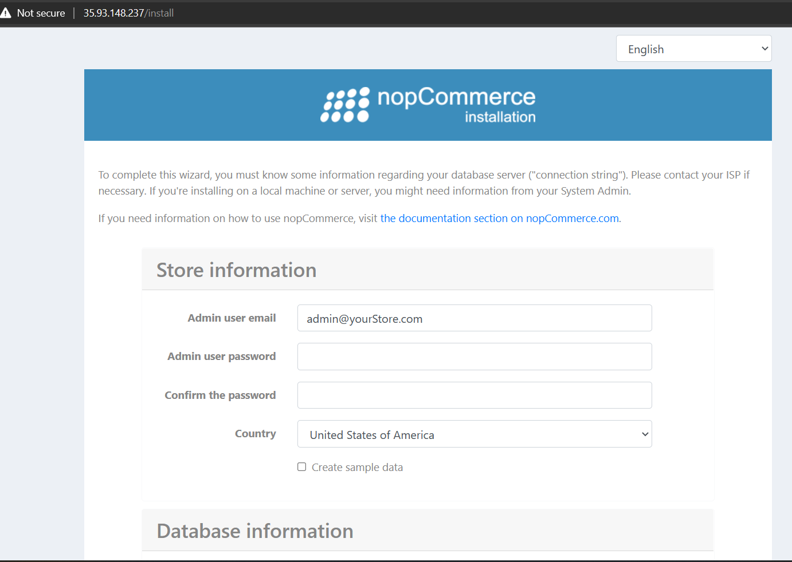
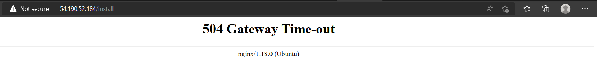

nopCommerce Deployment in K8s With Jenkins Pipeline
---------------------------------------------------

# Installing Manually in Linux Machine(Ubuntu 20.04)
 * For Official Documentation [ReferHere](https://docs.nopcommerce.com/en/installation-and-upgrading/installing-nopcommerce/installing-on-linux.html)
  * Register Microsoft key and feed
    ```
     wget https://packages.microsoft.com/config/ubuntu/20.04/packages-microsoft-prod.deb -O packages-microsoft-prod.deb
     sudo dpkg -i packages-microsoft-prod.deb
    ```
 
  * Install the .NET Core Runtime
    * Update the products available for installation, then install the .NET runtime:
    ```
     sudo apt-get update
     sudo apt-get install -y apt-transport-https aspnetcore-runtime-7.0
    ``` 
    * You can see all installed .Net Core runtimes by the following command:
    ```
     dotnet --list-runtimes
    ```
> In Manul Installation we skipped mySQL installation part because it throwing error.
 
 * Install nginx
   ```
    sudo apt-get install nginx -y
    sudo systemctl start nginx
    sudo systemctl status nginx
   ```
   * To configure nginx as a reverse proxy to forward requests to your ASP.NET Core app, modify /etc/nginx/sites-available/default. Open it in a text editor and replace the contents with the following:
   ```
    # Default server configuration
    #
    server {
     listen 80 default_server;
     listen [::]:80 default_server;

     server_name   nopCommerce.com;

     location / {
     proxy_pass         http://localhost:5000;
     proxy_http_version 1.1;
     proxy_set_header   Upgrade $http_upgrade;
     proxy_set_header   Connection keep-alive;
     proxy_set_header   Host $host;
     proxy_cache_bypass $http_upgrade;
     proxy_set_header   X-Forwarded-For $proxy_add_x_forwarded_for;
     proxy_set_header   X-Forwarded-Proto $scheme;
     }

    # SSL configuration
    #
    # listen 443 ssl default_server;
    # listen [::]:443 ssl default_server;
    #
    # Note: You should disable gzip for SSL traffic.
    # See: https://bugs.debian.org/773332
    #
    # Read up on ssl_ciphers to ensure a secure configuration.
    # See: https://bugs.debian.org/765782
    #
    # Self signed certs generated by the ssl-cert package
    # Don't use them in a production server!
    #
    # include snippets/snakeoil.conf;
    }
   ```

# Get nopCommerce
  * Create a directory:
    ```
    sudo mkdir /var/www/nopCommerce
    ```
  * Download and unpack nopCommerce:
    ```
    cd /var/www/nopCommerce

    sudo wget https://github.com/nopSolutions/nopCommerce/releases/download/release-4.60.0/nopCommerce_4.60.0_NoSource_linux_x64.zip

    sudo apt-get install unzip

    sudo unzip nopCommerce_4.60.0_NoSource_linux_x64.zip
    ```
  * Create couple directories to run nopCommerce:
    ```
    sudo mkdir bin
    sudo mkdir logs
    ```
  * Change the file permissions:
    ```
    cd ..
    sudo chgrp -R www-data /var/www/nopCommerce/
    sudo chown -R www-data /var/www/nopCommerce/
    ```
Create the nopCommerce service
------------------------------

* Create the /etc/systemd/system/nopCommerce.service file with the following contents:
  ```
  [Unit]
  Description=Example nopCommerce app running on Xubuntu

  [Service]
  WorkingDirectory=/var/www/nopCommerce
  ExecStart=/usr/bin/dotnet /var/www/nopCommerce/Nop.Web.dll
  Restart=always
  # Restart service after 10 seconds if the dotnet service crashes:
  RestartSec=10
  KillSignal=SIGINT
  SyslogIdentifier=nopCommerce-example
  User=www-data
  Environment=ASPNETCORE_ENVIRONMENT=Production
  Environment=DOTNET_PRINT_TELEMETRY_MESSAGE=false

  [Install]
  WantedBy=multi-user.target
  ```

  * Start the service:
    ```
     sudo systemctl start nopCommerce.service
    ```
  * Check the nopCommerce service status:
    ```
    sudo systemctl status nopCommerce.service
    ```
  * Restart the nginx server:
    ```
    sudo systemctl restart nginx
    ```
* nopCommerce home page


* Error: With mysql Database it's looks like this
