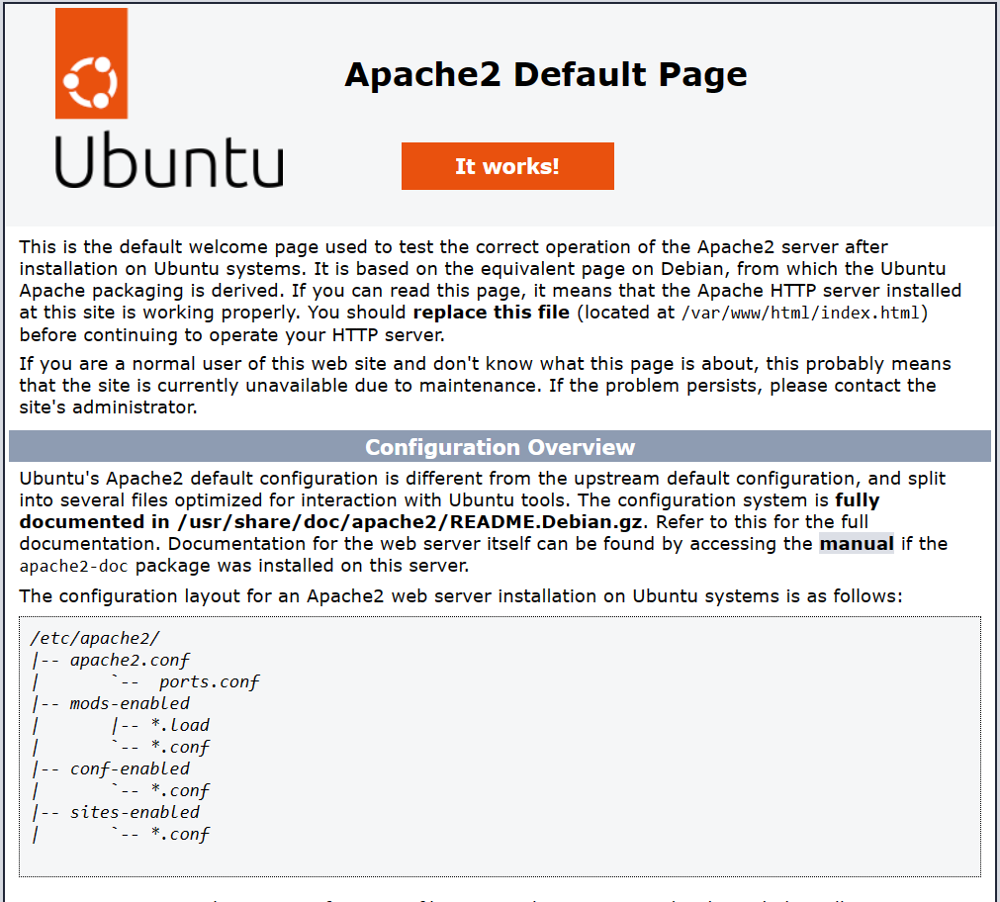
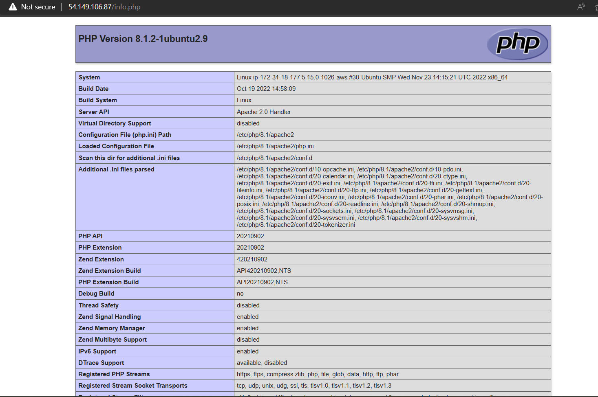

Linux, Apache, MySQL, PHP
-------------------------

* For Documentation by Digital Ocean [ReferHere](https://www.digitalocean.com/community/tutorials/how-to-install-linux-apache-mysql-php-lamp-stack-on-ubuntu-20-04#step-3-installing-php)
* 
```yaml
- name: LAMP setup
  hosts: all
  become: yes
  tasks:
    - name: installing apache2
      ansible.builtin.apt: 
        name: apache2
        update_cache: yes
        state: present
    - name: installing php
      ansible.builtin.apt:
        name: php
        state: present
    - name: installing libapache2-mod-php
      ansible.builtin.apt:
        name: libapache2-mod-php
        state: present
    - name: installing php-mysql
      ansible.builtin.apt:
        name: php-mysql
        state: present
    - name: coping php.info
      ansible.builtin.copy:
        src: ~/task-jan-03/info.php
        dest: /var/www/html/info.php
        owner: root
        group: root
        mode: u+rw,g+r,o+r

    # - name: creating php.info
    #   ansible.builtin.command:
    #     cmd: "echo '<?php phpinfo( ); ?>' > info.php"
    # - name: coping php.info
    #   ansible.builtin.command:
    #     cmd: "sudo cp info.php /var/www/html/info.php"
    #  sudo nano /var/www/html/info.php
    #  echo '<?php phpinfo( ); ?>' > info.php
    #  sudo cp info.php /var/www/html/info.php 
```
apache2 web page 
php info 