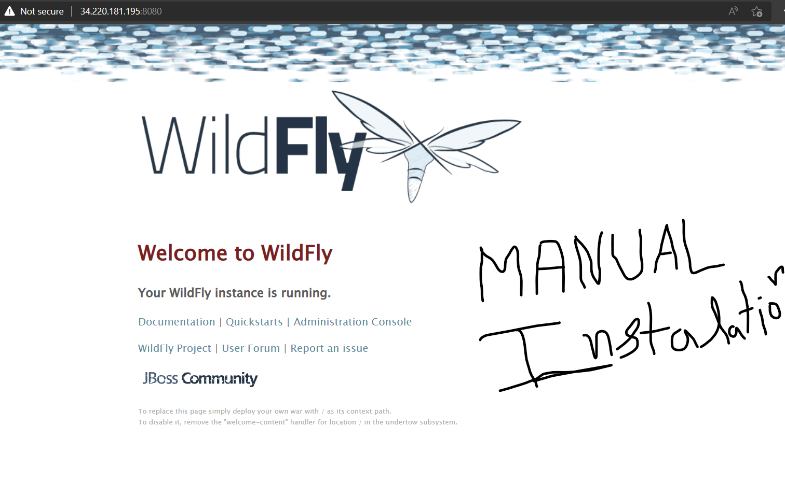

Installing WildFly on Ubuntu 20.04
----------------------------------

* Document followed to install [ReferHere](https://www.hackerxone.com/2021/09/01/step-by-step-to-install-configure-wildfly-jboss-on-ubuntu-20-04/#:~:text=Step%20by%20Step%20to%20Install%20%26%20Configure%20WildFly,the%20following%20port%20number%20on%20UFW%20firewall.%20)
* manual commands to install
```
sudo apt update
sudo apt-get install default-jdk
java -version
sudo groupadd -r wildfly
sudo useradd -r -g wildfly -d /opt/wildfly -s /sbin/nologin wildfly
cd /tmp
sudo wget https://download.jboss.org/wildfly/22.0.1.Final/wildfly-22.0.1.Final.tar.gz
sudo tar xvf wildfly-22.0.1.Final.tar.gz
sudo mv wildfly-22.0.1.Final/ /opt/wildfly
sudo chown -RH wildfly: /opt/wildfly
sudo mkdir -p /etc/wildfly
sudo cp /opt/wildfly/wildfly-22.0.1.Final/docs/contrib/scripts/systemd/wildfly.conf /etc/wildfly/
sudo cp /opt/wildfly/wildfly-22.0.1.Final/docs/contrib/scripts/systemd/launch.sh /opt/wildfly/wildfly-22.0.1.Final/bin/
sudo sh -c 'chmod +x /opt/wildfly/wildfly-22.0.1.Final/bin/*.sh'
sudo cp /opt/wildfly/wildfly-22.0.1.Final/docs/contrib/scripts/systemd/wildfly.service /etc/systemd/system/
sudo systemctl start wildfly.service
sudo systemctl enable wildfly.service
sudo systemctl status wildfly.service
```
* Suceesfully installed manually


Ansible Playbook to install Wildfly in ubuntu 20.04
---------------------------------------------------

```yaml
---
- name: installing wildfly in ubuntu 20.04
  hosts: all
  become: yes
  vars: 
    version: "22.0.1"
    java: openjdk-11-jdk

  tasks: 
    - name: installing java
      ansible.builtin.apt:
        name: "{{ java }}"
        update_cache: true
        state: present
    - name: create a system account for wildfly group
      ansible.builtin.group:
        name: wildfly
        system: true
        state: present
    - name: create a system account for wildfly user
      ansible.builtin.user:
        name: wildfly
        group: wildfly
        system: true
        home: /opt/wildfly
        shell: /sbin/nologin
        state: present
        create_home: true
    - name: download wildfly tar file
      ansible.builtin.get_url:
        url: https://download.jboss.org/wildfly/22.0.1.Final/wildfly-22.0.1.Final.tar.gz
        dest: /tmp
        mode: '0440'
    - name: untaring the tar file
      ansible.builtin.unarchive:
        src: /tmp/wildfly-22.0.1.Final.tar.gz
        dest: /tmp/
        remote_src: true
    - name: copy file with owner and permissions
      ansible.builtin.copy:
        src: /tmp/wildfly-22.0.1.Final/
        dest: /opt/wildfly
        owner: wildfly
        group: wildfly
        remote_src: true
        mode: '0777'
    - name: changing ownership of wildfly
      ansible.builtin.file:
        path: /opt/wildfly
        owner: wildfly
        group: wildfly
        recurse: true
        mode: '0777'
    - name: Create /etc/wildfly directory 
      ansible.builtin.file:
        path: /etc/wildfly
        state: directory
        mode: '0777'
    - name: copying files to /etc/wildfly
      ansible.builtin.copy:
        src: /opt/wildfly/docs/contrib/scripts/systemd/wildfly.conf
        dest: /etc/wildfly/
        remote_src: true
        mode: '0777'
    - name: copying files to /opt/wildfly/bin/
      ansible.builtin.copy:
        src: /opt/wildfly/docs/contrib/scripts/systemd/launch.sh
        dest: /opt/wildfly/bin/
        remote_src: true
        mode: '0777'
    - name: Execute the command in remote shell
      ansible.builtin.command: sh -c 'chmod +x /opt/wildfly/wildfly-22.0.1.Final/bin/*.sh'
    - name: copying files to /opt/wildfly/bin/
      ansible.builtin.copy:
        src: /opt/wildfly/docs/contrib/scripts/systemd/wildfly.service
        dest: /etc/systemd/system/
        remote_src: true
        mode: '0777'
    - name: starting wildfly service
      ansible.builtin.systemd:
        name: wildfly.service
        state: started
        enabled: yes
    - name: restarting wildfly service
      ansible.builtin.systemd:
        name: wildfly.service
        state: restarted
        enabled: yes

```

