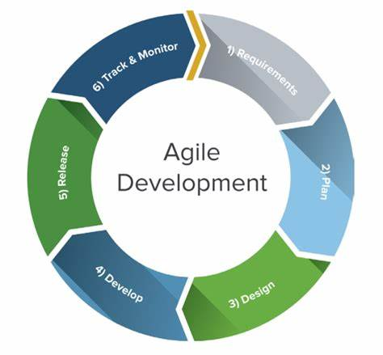
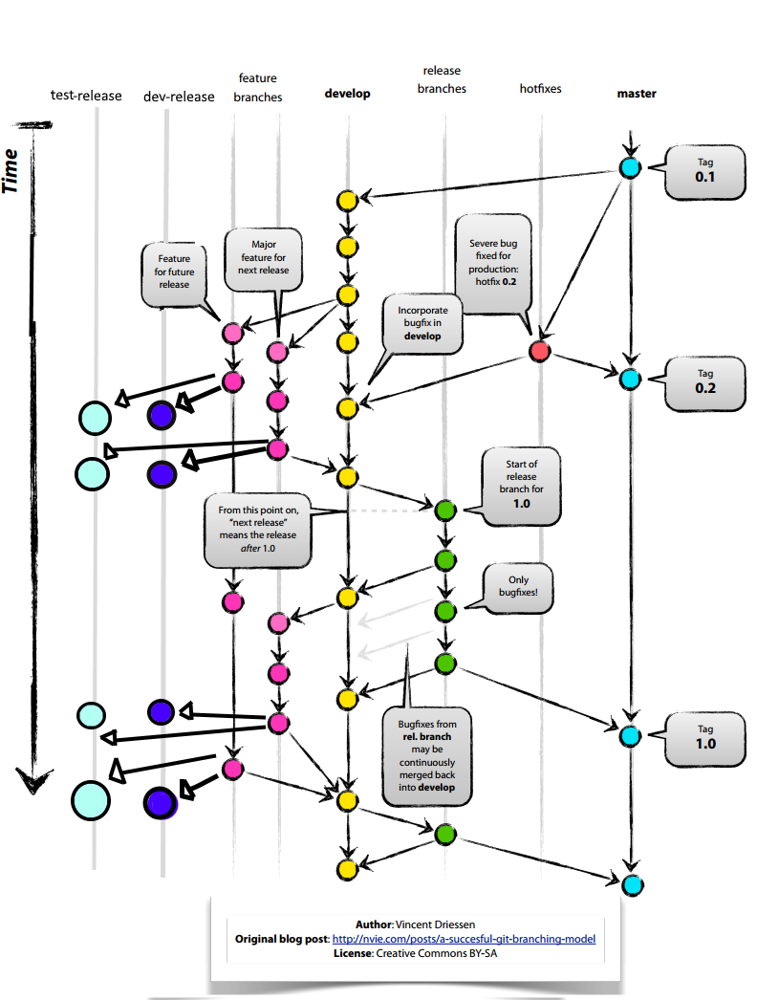

> 2022-12-27
DevOps Life Cycle Explanation (End to End)
------------------------------------------
# Software Devlopment
  * In software devolopment life cycle there are several stages
    1. Planing
    2. Codeing
    3. Building
    4. Testing
    5. Deployment
    6. Operation
    7. Monitoring
    
  * A Devops Engineer work start from when ever a devloper pushes his code to SCM.
  * here we are using git hub is our SCM.
# GIT Branching Strategie
  * Every organization flow different branching strategies. Our strategie is shown below 
    
  * From the above image we can observe different branches are present.
  * when ever we start a new sprint devlopers clone code from `master` branch to `devlop` branch, then to feature branches.
  * from there devlopers work on new features for the next release.
  * at the end of the day every devloper push what ever the changes he done to SCM.
  * from here we start our job as a devops engineer.
  * we took the source code from scm & perform day build for every commit in the `devlop` branch.
  * with CI/CD tools Jenkins & Azure-DevOps.
  * in this day build we perform basic tests like smoke test & unit tests
  * also we perform Code Quality Analysis with SonarQube Intigration. in this stage Technical Debt, Code Smell & Quality Gate Check for the code.
  * if the code passes all this we forward to package building and we store that packages in package repositories like jFrog Artofactory.
# Deploying Application
  * to our application we are following Microservice Deployment.
  * for that we need a container image in our case we are using Docker Container Technology.
  * to deploy application we need to build a docker image for that we are following `Dockerfile` image building method.
  * after creating the image we are pushing the image to container registory.  