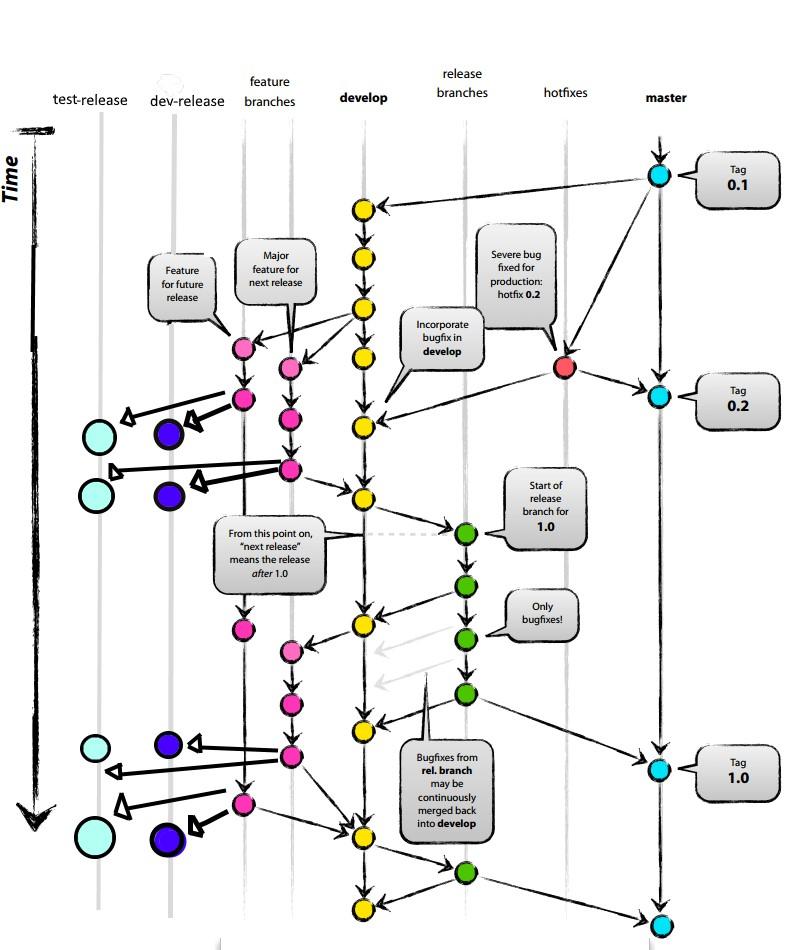

> 2022-12-27
DevOps Life Cycle Explanation (End to End)
------------------------------------------

* In software devolopment life cycle there are several stages
  1. Planing
  2. Codeing
  3. Building
  4. Testing
  5. Deployment
  6. Operation
  7. Monitoring
  
* A Devops Engineer work start from when ever a devloper pushes his code to SCM.
  